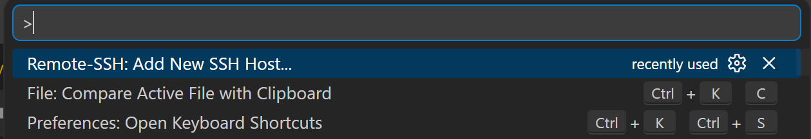
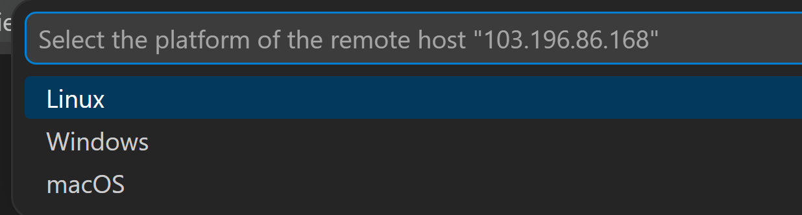
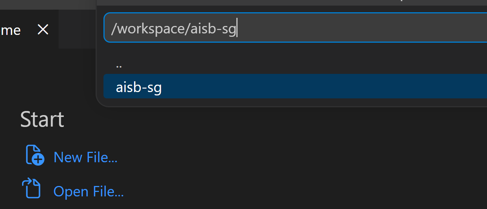
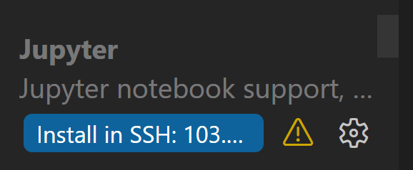

# W1D3 - LLM Inference Security

Today you'll examine four attack/defence domains that apply once an LLM is
deployed: tokenization and prompt construction, guardrails, knowledge
distillation attacks, and model-weight extraction via SVD. Each section
alternates between attacks and defences: you'll build something, break it,
and then build the next layer.

**Heads up:** today you'll be working on a remote machine with GPUs. The
first section below walks through the VS Code setup for connecting to it.

## Table of Contents

- [Content & Learning Objectives](#content--learning-objectives)
    - [Local generation & prompt construction](#local-generation--prompt-construction)
    - [Jailbreaking & prompt injection](#jailbreaking--prompt-injection)
    - [Guardrails: attacks and defences](#guardrails-attacks-and-defences)
    - [Knowledge distillation attacks](#knowledge-distillation-attacks)
    - [Model weight extraction via SVD](#model-weight-extraction-via-svd)
- [VS Code setup: connecting to the remote GPU machine](#vs-code-setup-connecting-to-the-remote-gpu-machine)
- [Local generation & prompt construction](#local-generation--prompt-construction-1)
    - [Exercise 1.1: Generate a response](#exercise-11-generate-a-response)
    - [Exercise 1.2: `continue_final_message` and infinite loops](#exercise-12-continue_final_message-and-infinite-loops)
    - [Exercise 1.3: Thinking vs non-thinking models](#exercise-13-thinking-vs-non-thinking-models)

## Content & Learning Objectives

### Local generation & prompt construction
A GPU warm-up. Building on Day 1's tokenization and chat templates, you'll
load a model locally and run the generation loop, then see how
prompt-construction choices shape what the model produces — the edge cases
where many prompt-injection and jailbreak attacks start.
> **Learning Objectives**
> - Run the local generation loop with `model.generate()`
> - See how `continue_final_message` changes generation (the basis of assistant prefill)
> - Compare thinking vs non-thinking models (chain-of-thought)

### Jailbreaking & prompt injection
Hands-on experience attacking safety-trained models to understand the
techniques that guardrails must defend against.
> **Learning Objectives**
> - Experience jailbreaking techniques first-hand (role-playing, encoding, context manipulation)
> - Categorise attack types and understand why safety training is a statistical, not structural, defence
> - Read the research on prompt injection and jailbreak taxonomies

### Guardrails: attacks and defences
Starting from a safety-trained LLM, build progressively stronger defences
against harmful-content requests — keyword filters, LLM classifiers, output
classifiers, linear probes on internal representations — attacking each
layer before building the next.
> **Learning Objectives**
> - Implement the generate/inference loop
> - Understand why keyword filters fail against paraphrases
> - Implement an LLM-as-judge safety classifier
> - Train a linear probe on internal activations as a final defence

### Knowledge distillation attacks
Implement a distillation training loop from scratch and show that filtering
dangerous tokens from CE labels does not prevent them from transferring to
the student through the teacher's soft probability distribution.
> **Learning Objectives**
> - Implement a single-example PyTorch training step
> - Understand `ignore_index=-100` for masked supervision
> - Implement a KD loss (temperature-scaled KL divergence)
> - See empirically why label filtering fails against KD

### Model weight extraction via SVD
Recover a model's hidden dimension — and the last projection layer — from
API access alone, using the logits-matrix SVD attack.
> **Learning Objectives**
> - Collect logits from random prompts via black-box queries
> - Use SVD to find the model's hidden dimension from the singular value spectrum
> - Reconstruct the output projection layer up to a linear transformation


## VS Code setup: connecting to the remote GPU machine

Today's exercises run on a remote machine with GPUs. Set up VS Code to
connect to it over SSH before starting Section 1.

1. Install the [Remote - SSH](https://marketplace.visualstudio.com/items?itemName=ms-vscode-remote.remote-ssh)
   extension in VS Code.
2. Set correct permissions on the SSH key file given to you by the instructors.
   SSH clients refuse keys that are readable by other users.

   **Linux / macOS:**
   ```bash
   chmod 600 <private-key-path>
   ```

   **Windows** (PowerShell — run as your normal user, not as Administrator):
   ```powershell
   $key = "<private-key-path>"
   icacls $key /inheritance:r /grant:r "$($env:USERNAME):(R)"
   ```

3. Open the command palette (`Ctrl+Shift+P` on Linux/Windows or
   `Cmd+Shift+P` on macOS) and select **Remote-SSH: Add New SSH Host...**

   
3. Enter the following command, replacing `<ip>`, `<port>`, and `<private-key-path>` with the IP address, port and <b>absolute</b> path to the SSH key given
   to you by the instructors:

   ```
   ssh root@<ip> -p <port> -i <private-key-path> -o StrictHostKeyChecking=no -o PasswordAuthentication=no -o IdentitiesOnly=yes
   ```

   When asked which SSH config file to update, pick the one in your user
   home directory (e.g. `~/.ssh/config` or `C:\\Users\\<you>\\.ssh\\config`).
4. Open the command palette again and select **Remote-SSH: Connect to Host...**,
   then pick the host you just added. VS Code will open a new window
   connected to the remote machine.
5. When prompted for the remote platform, select **Linux**.

   
6. Once connected, open the folder `/workspace/aisb-sg`.

   
7. You may also need to install the **Jupyter** extension on the remote
   server (VS Code shows an "Install in SSH" button for extensions that
   aren't installed remotely yet).

   
8. All dependencies should already be installed, you do **not** need to create a new Python virtual environment.

Once the remote workspace is open, create file `3.1-tokenization/day3_answers.py` and continue with Section 1 as usual.


## Local generation & prompt construction

Day 1 covered the basics of tokenization and chat templates: how strings
are split into token IDs, how `apply_chat_template` wraps messages with
role-marker tokens, how different model families use different template
formats, and the two parameters that control where the prompt ends —
`add_generation_prompt` and `continue_final_message` (Day 1 Exercise 1.4).

On Day 1 we only rendered those prompts as strings. Here we build directly
on that: we load a model locally, run the actual generation loop, and see
first-hand how `continue_final_message` changes what the model produces —
the behaviour that makes it directly relevant to prompt injection attacks.


```python


from transformers import AutoTokenizer, AutoModelForCausalLM
from typing import Callable
import torch
import sys
from pathlib import Path

_root = next(p for p in Path(__file__).resolve().parents if (p / "aisb_utils").is_dir())
if str(_root) not in sys.path:
    sys.path.insert(0, str(_root))

from aisb_utils import report

CACHE_DIR = "/tmp/cache-tokenizer"


def load_tokenizer(model_name: str, cache_dir: str = CACHE_DIR) -> AutoTokenizer:
    """Load a HuggingFace tokenizer (provided helper)."""
    tokenizer = AutoTokenizer.from_pretrained(
        model_name, cache_dir=cache_dir, trust_remote_code=True,
    )
    if tokenizer.pad_token is None:
        tokenizer.pad_token = tokenizer.eos_token
        tokenizer.pad_token_id = tokenizer.eos_token_id
    return tokenizer


def load_model(model_name: str, cache_dir: str = CACHE_DIR):
    """Load a model and tokenizer for generation (provided helper)."""
    tokenizer = load_tokenizer(model_name, cache_dir)
    model = AutoModelForCausalLM.from_pretrained(
        model_name, torch_dtype=torch.float16, device_map="auto",
        cache_dir=cache_dir, trust_remote_code=True,
    )
    return model, tokenizer
```

### Exercise 1.1: Generate a response

> **Difficulty**: 🔴🔴⚪⚪⚪
> **Importance**: 🔵🔵🔵🔵⚪

Use the HuggingFace pipeline to generate a response from `Qwen/Qwen3-0.6B`:
format a question using `apply_chat_template`, tokenize it, call
`model.generate()`, and decode the output.

Recall the two `apply_chat_template` parameters from Day 1 Exercise 1.4:
- `add_generation_prompt=True` — appends the assistant header token so the
  model knows it should generate a reply, not continue the user turn.
- `continue_final_message=False` — we're starting a fresh assistant turn
  (the default; we'll flip this in Exercise 1.2).

Qwen3-0.6B is a **thinking model** — look for `<think>` tags in the output.


```python

# %%


def generate_response(question: str, model_name: str = "Qwen/Qwen3-0.6B") -> str:
    """Format a question as a chat prompt, generate a response, and return
    the decoded output."""
    # TODO: Load the model, format the question as a chat prompt,
    # tokenize it, generate a response, and decode the output.
    # Key steps: apply_chat_template -> tokenize -> model.generate -> decode
    # Use add_generation_prompt=True so the model knows to respond.
    # Check the HuggingFace docs for model.generate().
    return ""


print(generate_response("I'm trying to decide whether to take another bootcamp."))
from section1_test import test_generate_response


test_generate_response(generate_response)
```

### Exercise 1.2: `continue_final_message` and infinite loops

> **Difficulty**: 🔴🔴⚪⚪⚪
> **Importance**: 🔵🔵🔵⚪⚪

On Day 1 (Exercise 1.4) you predicted what happens when generation starts
from a `continue_final_message=True` prompt. Now let's confirm it on a real
model. Setting `continue_final_message=True` and `add_generation_prompt=False`
tells the model to **continue the user's message** instead of starting a new
assistant turn.

Try it with the same question. What do you observe?

**Question**: Why does the model produce an infinite loop (hitting
`max_new_tokens`)? What is it trying to do?

<details><summary>Hint: how to set up the generation</summary><blockquote>

```python
prompt = tokenizer.apply_chat_template(
    [{"role": "user", "content": question}],
    tokenize=False,
    add_generation_prompt=False,
    continue_final_message=True,
)
# Then tokenize and generate as in Exercise 1.1
```

</blockquote></details>

<details><summary>Answer</summary><blockquote>

With `continue_final_message=True`, the prompt ends **inside** the user
turn — there is no `<|im_end|>` token and no assistant header. The model
continues writing as the user, never switches to assistant mode, and
produces an endless stream of text until `max_new_tokens` cuts it off.

This is a useful technique for prompt injection: if an attacker can make
the model believe it's still inside the user turn, it may follow different
behavioural patterns than when it knows it's the assistant.

</blockquote></details>


```python

# %%


def generate_continue_message(question: str, model_name: str = "Qwen/Qwen3-0.6B") -> str:
    """Generate with continue_final_message=True to see the infinite-loop
    behaviour."""
    # TODO: Same as 1.1, but change the template parameters so the
    # model *continues* the user's message instead of starting a new
    # assistant turn. Check the hint above if you're unsure which
    # parameters to change. Cap max_new_tokens=256.
    return ""


print(generate_continue_message("I'm trying to decide whether to take another bootcamp."))
```

### Exercise 1.3: Thinking vs non-thinking models

> **Difficulty**: 🔴🔴⚪⚪⚪
> **Importance**: 🔵🔵🔵🔵⚪

Run the same questions through both a **thinking** model
(`Qwen/Qwen3-0.6B`) and a **non-thinking** model (`Qwen/Qwen2.5-0.5B`).

Compare the outputs: how does chain-of-thought affect the response? Look
at the thinking tags in the Qwen3 output vs the direct answer from Qwen2.5.


```python

# %%


def compare_thinking_models(
    questions: list[str],
    model_names: list[str] = ["Qwen/Qwen3-0.6B", "Qwen/Qwen2.5-0.5B"],
) -> None:
    """Generate and print responses for each (model, question) pair."""
    # TODO: For each model and question, generate a response
    # (same pipeline as 1.1) and print the result. Compare the
    # outputs between the thinking and non-thinking model.
    pass


compare_thinking_models([
    "What is the capital of Japan?",
    "What is the distance between London and Edinburgh?",
])
```