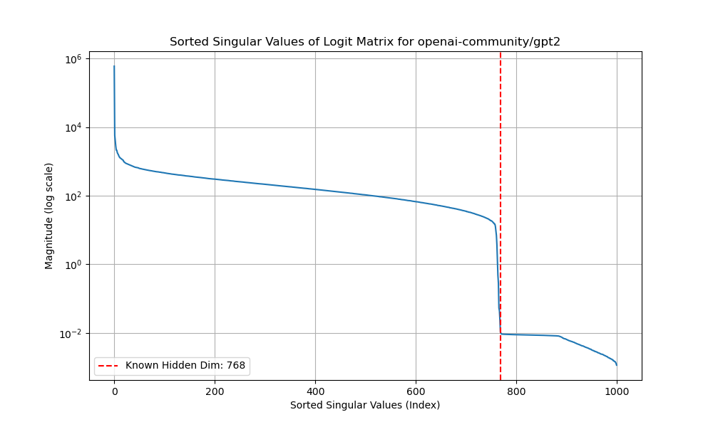

# W1D3 - Section 5: Logit-Space Dimension and Subspace Extraction

This section uses black-box logit queries and singular value decomposition to
infer a model's hidden dimension and recover its output subspace up to an
unknown linear transform.

## Table of Contents

- [Logit-space dimension and subspace extraction](#logit-space-dimension-and-subspace-extraction)
    - [Exercise 5.1 - Complete Model Dimension Extraction](#exercise-51---complete-model-dimension-extraction)
    - [Exercise 5.2 - Recovering the Output Subspace](#exercise-52---recovering-the-output-subspace)
    - [Extensions to try](#extensions-to-try)
- [Summary & Further Reading](#summary--further-reading)
    - [Further reading](#further-reading)

## Logit-space dimension and subspace extraction

The attack reveals structural information about the final projection, but does
not by itself recover independently usable white-box weights.

> **Learning Objectives**
> - Build a logit query matrix and estimate its numerical rank
> - Explain why low-rank logits reveal the model's hidden dimension
> - Distinguish output-subspace recovery from exact weight recovery
> - Relate query volume and logit precision to extraction feasibility


```python


import sys
from pathlib import Path

_root = next(p for p in Path(__file__).resolve().parents if (p / "aisb_utils").is_dir())
if str(_root) not in sys.path:
    sys.path.insert(0, str(_root))

from aisb_utils import report
```

Let's implement the model extraction attack from
[Carlini et al. (2024), *Stealing Part of a Production Language Model*](https://arxiv.org/abs/2403.06634).

### Exercise 5.1 - Complete Model Dimension Extraction

> **Difficulty**: 🔴🔴🔴⚪⚪
> **Importance**: 🔵🔵🔵🔵⚪
>
> You should spend up to ~45 minutes on this exercise.

Complete the implementation of model dimension extraction using SVD.


<details>
<summary>(spoiler) If everything goes well, this is what your graph should look like</summary><blockquote>


</blockquote></details>


```python

# %%
import torch
import numpy as np
import matplotlib.pyplot as plt
from transformers import GPT2Tokenizer, GPT2LMHeadModel
from tqdm import tqdm
model_name = "openai-community/gpt2"
print(f"Loading model: {model_name}...")
tokenizer = GPT2Tokenizer.from_pretrained(model_name)
model = GPT2LMHeadModel.from_pretrained(model_name)
model.eval()

def get_next_logits(input_ids: torch.Tensor) -> torch.Tensor:
    """
        Get the logits for the next token given input_ids.
        """
    assert input_ids.ndim == 2, "Input IDs should be a 2D tensor (batch_size, sequence_length)"
    with torch.no_grad():
        outputs = model(input_ids)
        return outputs.logits[:, -1, :]

# Set pad token if it's not set
if tokenizer.pad_token is None:
    tokenizer.pad_token = tokenizer.eos_token

# Shared attack parameters, used by both Exercise 5.1 and 5.2.
N_QUERIES = 1000
MAX_PROMPT_LENGTH = 10
VOCAB_SIZE = tokenizer.vocab_size
print(f"Vocabulary size (l): {VOCAB_SIZE}")
print(f"Number of queries (n): {N_QUERIES}")


def detect_hidden_dim(
    n_queries: int = N_QUERIES,
    max_prompt_length: int = MAX_PROMPT_LENGTH,
    plot: bool = True,
) -> int:
    """Discover the model's hidden dimension from black-box logit queries.

    Sends many random token sequences to `get_next_logits`, stacks the
    resulting logit vectors into a matrix, computes its singular value
    spectrum, and returns the detected hidden dimension (the index of the
    sharp drop in the spectrum).
    """
    # TODO: Discover the model's hidden dimension using only black-box
    # logit queries.
    #   1. Send many random token sequences to get_next_logits.
    #   2. Stack the results into a matrix Q (n_queries, vocab_size).
    #   3. Compute its singular values (np.linalg.svd(..., compute_uv=False)).
    #   4. Plot the spectrum on a log scale, and look at where there is a sharp drop: eyeball it and return it
    #   5. (optional) The hidden dimension is the index of the sharp drop in the
    #      spectrum — e.g. argmax of the gaps between consecutive
    #      log-singular-values, plus one.
    # Return the detected hidden dimension as an int (768 for GPT-2 small).
    return 0


detected_h = detect_hidden_dim()
print(f"Using hidden dimension (h): {detected_h}")
from section5_test import test_detect_hidden_dim


test_detect_hidden_dim(detect_hidden_dim)
```

### Exercise 5.2 - Recovering the Output Subspace

> **Difficulty**: 🔴🔴🔴🔴🔴
> **Importance**: 🔵🔵⚪⚪⚪
>
> You should spend up to ~60 minutes on this exercise.

Now use the hidden dimension `h` from exercise 5.1 to recover a basis for the
column space of the model's output projection from black-box logit queries.

**Why SVD reveals the subspace.** Every logit vector the model returns is computed as:

```
logits = hidden_state @ W_out.T + bias
```

where `W_out` has shape `(vocab_size, h)`. Across many queries, the hidden states
span an `h`-dimensional subspace of the full `vocab_size`-dimensional space. If we
collect these logit vectors as columns of a matrix `Q` (shape `vocab_size × n_queries`),
then `Q` has rank at most `h`. The thin SVD decomposes:

```
Q ≈ U_h · Σ_h · Vh
```

where `U_h` has shape `(vocab_size, h)`. The columns of `U_h` form an orthonormal
basis for the same column space as `W_out`. Therefore `U_h @ Σ_h` is `W_out` up
to an unknown invertible linear transformation — we can reconstruct the direction
and relative scaling of every output-projection row, but not the exact values
(which would require knowing the hidden states too).

This is the "up to a linear transform" claim: the recovered representative and the true
`lm_head.weight` are related by `W_extracted @ G ≈ W_true` for some matrix `G`.
`compare_weights` solves for `G` using the true weights and then measures how
close the aligned matrices are. That is a white-box validation of the recovered
subspace; a black-box attacker would not possess `W_true` and therefore does not
obtain independently usable exact weights from this step alone.


```python

def extract_weights(
    hidden_dim: int,
    n_queries: int = N_QUERIES,
    max_prompt_length: int = MAX_PROMPT_LENGTH,
    batch_size: int = 2,
) -> np.ndarray:
    """Recover a representative of the output projection's column space.

    Collects logit vectors from many (batched) random queries, stacks them
    into a matrix Q of shape (vocab_size, n_samples), takes the thin SVD, and
    returns U_h @ Sigma_h — a subspace representative related to the true
    projection by an unknown linear transform. Returns a NumPy array of shape
    (vocab_size, hidden_dim).
    """
    # TODO: Extract the output projection weights from logit queries.
    #   1. Collect logit vectors from many random queries (batch them for
    #      speed) and stack them so each logit vector is a *column* of Q.
    #   2. Perform the thin SVD: U, s, Vh = torch.linalg.svd(Q, full_matrices=False).
    #   3. Keep the top `hidden_dim` directions and return U_h @ Sigma_h
    #      as a NumPy array of shape (vocab_size, hidden_dim).
    # (Placeholder keeps the scaffold runnable; at least one column so the
    # downstream least-squares alignment is well-formed.)
    return np.zeros((VOCAB_SIZE, max(hidden_dim, 1)))


W_extracted = extract_weights(detected_h)
print(f"Extracted weight matrix shape: {W_extracted.shape}")
true_weights = model.lm_head.weight.detach().numpy()


# %%
def compare_weights(W_extracted: np.ndarray, W_true: np.ndarray) -> tuple[float, float, float]:
    """
    Compares the extracted weight matrix with the ground truth matrix.

    Args:
        W_extracted: The weights recovered from the attack (W_tilde).
        W_true: The ground truth weights from the model.

    Returns:
        tuple: (rmse, avg_cosine_sim, percentage_similarity)
    """
    print("\n--- Comparing Extracted Weights to Ground Truth ---")

    # 1. Solve for the transformation matrix G using least squares
    # We want to find G such that W_extracted @ G ≈ W_true
    print("Solving for the alignment matrix G using least squares...")
    try:
        G, residuals, rank, s = np.linalg.lstsq(W_extracted, W_true, rcond=None)
    except np.linalg.LinAlgError as e:
        print(f"Error solving least squares: {e}")
        return float("nan"), float("nan"), float("nan")

    # 2. Align the extracted weights using the solved G
    W_aligned = W_extracted @ G
    print("Alignment complete.")

    # 3. Calculate Root Mean Square Error (RMSE)
    temp = (W_aligned - W_true) ** 2
    rmse = np.sqrt(temp.mean())

    # 4. Calculate Average Cosine Similarity
    # Normalize each column vector to unit length before dot product
    norm_aligned = np.linalg.norm(W_aligned, axis=0, keepdims=True)
    norm_true = np.linalg.norm(W_true, axis=0, keepdims=True)

    # Avoid division by zero for zero-norm vectors
    # This is unlikely but good practice
    norm_aligned[norm_aligned == 0] = 1
    norm_true[norm_true == 0] = 1

    W_aligned_normalized = W_aligned / norm_aligned
    W_true_normalized = W_true / norm_true

    # Calculate cosine similarity for each column and average
    cosine_similarities = (W_aligned_normalized * W_true_normalized).sum(axis=0)
    avg_cosine_sim = cosine_similarities.mean()

    # 5. Calculate a "Percentage Similarity" metric based on relative error
    # Frobenius norm is the square root of the sum of the absolute squares of its elements.
    relative_error = np.linalg.norm(W_aligned - W_true, "fro") / np.linalg.norm(W_true, "fro")
    percentage_similarity = (1 - relative_error) * 100

    return rmse, avg_cosine_sim, percentage_similarity


# 4. Compare the weights and print results
rmse, cosine_sim, percent_sim = compare_weights(W_extracted, true_weights)

print("\n--- Final Results ---")
print(f"Root Mean Square Error (RMSE): {rmse:.6f}")
print(f"Average Cosine Similarity: {cosine_sim:.6f}")
print(f"Similarity Percentage: {percent_sim:.2f}%")

print("\nInterpretation:")
print("- RMSE: Lower is better. We expect values like 0.001.")
print("- Cosine Similarity: Closer to 1.0 is better, indicating the vectors are pointing in the same direction.")
print("- Similarity Percentage: Closer to 100% is better.")
from section5_test import test_compare_weights


test_compare_weights(detect_hidden_dim, extract_weights, compare_weights)
```

### Extensions to try
- What if you only have access to topk logits instead of the full logits?
- What if you don't have access to the logits? (this is quiet expensive, so just extract one logit with the method listed in appendix F)


## Summary & Further Reading

Today covered four layers of LLM inference security:

**1. Tokenization & prompt construction** — Tokenizers are not transparent:
different models tokenize the same string differently, and chat templates
assemble multi-turn prompts with special tokens. Edge cases in tokenization
and prompt construction are where many prompt-injection attacks begin.

**2. Guardrails: attacks and defences** — Safety training alone is defeated
by simple paraphrases. Keyword filters are defeated by synonyms. LLM-based
input classifiers are defeated by creative reframing (fiction, research).
Output classifiers share the same limitation. Linear probes on internal
representations catch what text-based classifiers miss, because they operate
on semantic intent rather than surface form.

**3. Knowledge distillation attacks** — Label filtering (masking forbidden
tokens with `ignore_index=-100`) prevents a baseline student from learning
the forbidden completion. But adding a KD loss (temperature-scaled KL
divergence from the teacher) transfers the forbidden knowledge through the
soft probability distribution. Label filtering is necessary but not
sufficient for safe distillation.

**4. Model weight extraction via SVD** — By collecting logits from random
prompts and computing SVD, an attacker can recover the model's hidden
dimension from the singular value spectrum, and reconstruct the output
projection layer up to a linear transformation.

### Further reading

- [Hinton, Vinyals & Dean (2015), *Distilling the Knowledge in a Neural Network*](https://arxiv.org/abs/1503.02531)
- [Carlini et al. (2024), *Stealing Part of a Production Language Model*](https://arxiv.org/abs/2403.06634)
- [Tramèr et al. (2016), *Stealing Machine Learning Models via Prediction APIs*](https://arxiv.org/abs/1609.02943)
- [Burns et al. (2022), *Discovering Latent Knowledge*](https://arxiv.org/abs/2212.03827)
- [Zou et al. (2023), *Representation Engineering*](https://arxiv.org/abs/2310.01405)
- [Hubinger et al. (2024), *Sleeper Agents*](https://arxiv.org/abs/2401.05566)
