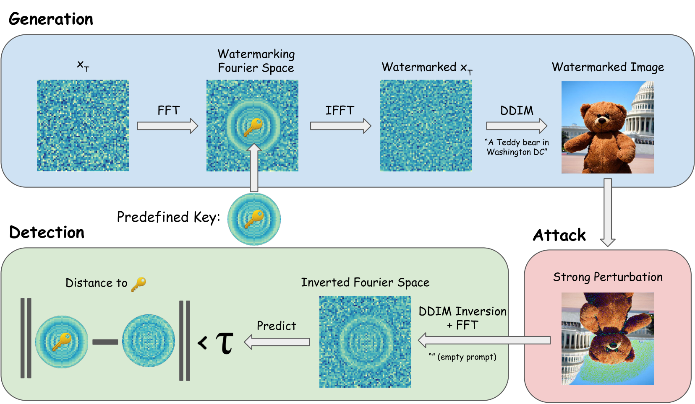
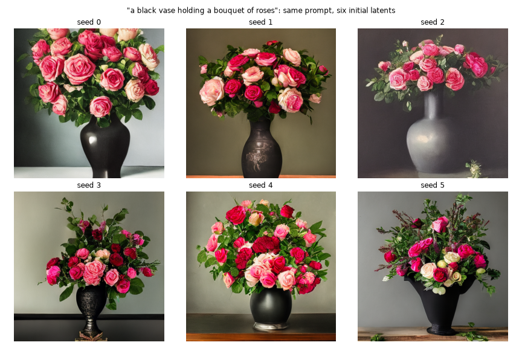

# Day 6 — Section 4: Keyed Watermarks for Diffusion Images (Optional)

This is optional additional content for Day 6. Complete Sections 6.1–6.3 first.

## Table of Contents

- [Content & Learning Objectives](#content--learning-objectives)
    - [Keyed Watermarks for Diffusion Images](#keyed-watermarks-for-diffusion-images)
- [Setup](#setup)
- [Generation with a Chosen Initial Latent](#generation-with-a-chosen-initial-latent)
- [Fourier Space, by Example (by Claude)](#fourier-space-by-example-by-claude)
- [The Key](#the-key)
    - [Exercise 6.4.1: The Ring Mask](#exercise-641-the-ring-mask)
    - [Exercise 6.4.2: Plant the Key in a Latent](#exercise-642-plant-the-key-in-a-latent)
    - [Exercise 6.4.3: Watermarked Initial Noise](#exercise-643-watermarked-initial-noise)
- [Detection by Inversion](#detection-by-inversion)
    - [DDIM Inversion (given)](#ddim-inversion-given)
    - [Exercise 6.4.4: Distance to the Key](#exercise-644-distance-to-the-key)
- [Calibrated Detection](#calibrated-detection)
    - [Exercise 6.4.5: Threshold and Detector](#exercise-645-threshold-and-detector)
- [Robustness](#robustness)
    - [Exercise 6.4.6: Detection Under Perturbation](#exercise-646-detection-under-perturbation)
- [What the Key Does and Does Not Protect](#what-the-key-does-and-does-not-protect)
    - [Exercise 6.4.7: A Keyless Detector](#exercise-647-a-keyless-detector)
    - [Recovering the secret without the key](#recovering-the-secret-without-the-key)
    - [From recovery to forgery](#from-recovery-to-forgery)
- [Summary](#summary)
    - [Further Reading](#further-reading)


The goal of today is to build a **keyed watermark** for a generative image model.

Watermarks are usually a perturbation to the pixels of an image. These can either be
clearly obvious (to incentivize the user to pay for the image) or more subtle
(so the image can be used without the watermark being visible, while allowing
for attribution). We focus on the second kind.

Watermarks added after the fact are usually quite fragile, and a simple
blur, compression or other image transformation can render the watermark useless.
[Zhao et al., 2024](https://arxiv.org/pdf/2306.01953) shows that any such watermark
based on a small pixel perturbation to remain invisible is easily removed
by noising the images, and then denoising it with a generative model.

The approach today will be to watermark the generation process of the image itself.
Different secret keys will lead to slightly different images being generated,
in a way that small perturbations cannot remove.

We build the simplest of these, a *Tree-Ring* watermark [Wen et al., 2023](https://arxiv.org/pdf/2305.20030):

1. We apply the Fourier transform to the initial noise for the diffusion model.
2. A secret key is encoded as a pattern of rings, and blended with the initial noise.
3. An image is generated from the noise.
4. To check if the image (or a perturbed version of it) has been watermarked, the sampler is
run in reverse to recover the original noise, and we check if the result is close to the secret key.

We calibrate the detector against a set of watermarked/clean images with perturbations, and
adjust the threshold for the desired false-positive/false-negative rate.



*Figure 1 of Wen, Kirchenbauer, Geiping and Goldstein, "Tree-Ring Watermarks", NeurIPS 2023. Top: generation.
The initial noise `x_T` is Fourier transformed, the ring key is written in, the inverse transform gives a watermarked
`x_T`, and ordinary DDIM sampling produces the image. Right: the image is perturbed by an attacker. Bottom:
detection. DDIM inversion with the empty prompt recovers the noise, its Fourier transform is compared to the key,
and a distance below the threshold τ means "watermarked". The sections below build each box.*


<details>
<summary>Vocabulary</summary><blockquote>

- **Latent**: the tensor of shape `(4, 64, 64)` that Stable Diffusion works in. Diffusion happens here, not on pixels.
- **VAE**: the encoder/decoder pair around the latent space. The decoder turns a latent into a 512 × 512 image;
  the encoder maps an image back to a latent. We use the decoder implicitly in generation and the encoder in
  detection.
- **Classifier-free guidance**: during generation the UNet is run twice per step, once with the prompt and once
  with an empty prompt, and the two noise predictions are combined with a weight (7.5 here) that pushes the sample
  towards the prompt. Detection runs only the empty-prompt half.
- **Initial noise / initial latent (`z_T`)**: the Gaussian tensor the sampler starts from. Everything about the
  image is a deterministic function of this tensor and the prompt when using DDIM.
- **DDIM**: a deterministic sampler. Each step is a closed-form formula, which is what makes inversion possible.
- **Spectrum**: the 2D Fourier transform of an array of shape `(64, 64)`. Each entry says how much of one stripe pattern
  (one spatial frequency and orientation) is present.
- **Key**: here, ten real numbers, one per ring, derived from a secret string.
- **Null distribution**: the distribution of the detector's statistic on images that carry no watermark.

</blockquote></details>

## Content & Learning Objectives

### Keyed Watermarks for Diffusion Images

> **Learning Objectives**
> - Read and write 2D Fourier spectra of latent tensors
> - Derive a keyed ring pattern from a secret and plant it in the initial latent
> - Invert DDIM sampling to recover the initial latent from an image
> - Calibrate a detector threshold to a target false-positive rate
> - Measure robustness to perturbations and the limits of key secrecy


```python


import sys
from pathlib import Path

_root = next(p for p in Path(__file__).resolve().parents if (p / "aisb_utils").is_dir())
if str(_root) not in sys.path:
    sys.path.insert(0, str(_root))

from aisb_utils import report
```

## Setup

Create a file named `day6_answers.py` in the `6.4-watermarking` directory. This will be your answer file for this
section.

If you see a code snippet here in the instruction file, copy-paste it into your answer file. Keep the `# %%` line to
make it a Python code cell.

Tensor arguments and return values are annotated with [jaxtyping](https://docs.kidger.site/jaxtyping/):
`Float[Tensor, "1 4 latent_size latent_size"]` is a float tensor of shape `(1, 4, 64, 64)`, `Bool[Tensor, "h w"]` is a boolean
tensor with two dimensions we call `h` and `w`, `Complex[...]` is complex-valued, and a leading `...` means "any
number of batch dimensions". Names that repeat within one signature must match. The annotations are documentation,
not runtime checks.

**Start by pasting the code below in your day6_answers.py file.**


```python

import hashlib
import io
import math
from typing import Callable

import matplotlib.pyplot as plt
import numpy as np
import torch
from diffusers import DDIMScheduler, StableDiffusionPipeline
from jaxtyping import Bool, Complex, Float
from PIL import Image, ImageFilter
from scipy.stats import norm
from torch import Tensor
from tqdm.auto import tqdm
MODEL_ID = "nota-ai/bk-sdm-v2-tiny"  # a distilled Stable Diffusion; fast enough to iterate on
LATENT_SIZE = 64  # 512x512 images have latents of shape (4, 64, 64)
CHANNEL = 3  # the latent channel that carries the watermark
RADIUS = 10  # the key lives inside this radius of the spectrum (low frequencies only)
STEPS = 50  # DDIM sampling steps for generation
INVERSION_STEPS = 20  # DDIM steps for inversion; fewer than generation, at a small cost in recovered-noise accuracy
SECRET = "correct horse battery staple"
PROMPT = "a black vase holding a bouquet of roses"

DEVICE = "cuda" if torch.cuda.is_available() else ("mps" if torch.backends.mps.is_available() else "cpu")
DTYPE = torch.float16 if DEVICE == "cuda" else torch.float32
```

## Generation with a Chosen Initial Latent

We use a distilled Stable Diffusion ([`nota-ai/bk-sdm-v2-tiny`](https://huggingface.co/nota-ai/bk-sdm-v2-tiny))
that generates a 512 × 512 image in about a second.
Its latents have shape `(4, 64, 64)` (channels, height, width), the same as Stable Diffusion 2,
so everything here transfers to the full-size model.

The pipeline accepts the initial latent directly through its `latents=` argument.
This is the only thing that we tamper with, generation for the model itself is
left untouched. Understanding how diffusion models work isn't vital for understanding
how today works, as the diffusion model is treated as a black box for our purposes.


```python


def setup_pipeline() -> StableDiffusionPipeline:
    """Load the Stable Diffusion model with a DDIM scheduler.

    Returns:
        The pipeline on DEVICE in DTYPE, with DDIM as its scheduler and the safety checker disabled.
    """
    pipe = StableDiffusionPipeline.from_pretrained(MODEL_ID, torch_dtype=DTYPE)
    pipe.scheduler = DDIMScheduler.from_config(pipe.scheduler.config)
    pipe.set_progress_bar_config(disable=True)
    pipe.safety_checker = None
    return pipe.to(DEVICE)

def generate_image(pipe: StableDiffusionPipeline, prompt: str, latents: Float[Tensor, "1 4 latent_size latent_size"], steps: int = STEPS) -> Image.Image:
    """Generate one image from a chosen initial latent.

    Args:
        pipe: The Stable Diffusion pipeline.
        prompt: Text prompt.
        latents: Initial noise of shape (1, 4, LATENT_SIZE, LATENT_SIZE) on the pipeline's device.
        steps: Number of DDIM sampling steps.

    Returns:
        The generated 512x512 RGB image.
    """
    return pipe(prompt, latents=latents, num_inference_steps=steps, guidance_scale=7.5).images[0]

pipe = setup_pipeline()
# A first image, from a seeded initial latent. We reuse it below.
demo_latent = torch.randn(1, 4, LATENT_SIZE, LATENT_SIZE, generator=torch.Generator(device=DEVICE).manual_seed(8), device=DEVICE, dtype=DTYPE)
demo_image = generate_image(pipe, PROMPT, demo_latent)
plt.figure(figsize=(5, 5))
plt.imshow(np.array(demo_image))
plt.axis("off")
plt.show()
```

With DDIM (a particular kind of sampling method for diffusion models),
the initial latent fully determines the downstream image.



Note that all the images are of the same thing, but are all quite different:
different coloured roses, different shaped vase, etc.
It is these differences that encode the watermark itself.


```python

fig, axes = plt.subplots(2, 3, figsize=(12, 8))
for ax, seed in zip(axes.flat, tqdm(range(6), desc="generating")):
    z = torch.randn(1, 4, LATENT_SIZE, LATENT_SIZE, generator=torch.Generator(device=DEVICE).manual_seed(seed), device=DEVICE, dtype=DTYPE)
    ax.imshow(np.array(generate_image(pipe, PROMPT, z)))
    ax.set_title(f"seed {seed}"); ax.axis("off")
fig.suptitle(f'"{PROMPT}"'); plt.tight_layout(); plt.show()
```

## Fourier Space, by Example (by Claude)

Here, we give a high level explination of what exactly the fourier transform
is capturing.

In 1D, any nice function can be written as a sum of sine waves. The fourier
transformer takes a function, and decomposes the function as a sum of sine waves
of varying frequency and amplitude. A nice explainer her be found [here](https://www.jezzamon.com/fourier/).

In 2D: Any array of shape `(64, 64)` can be written as a sum of wave patterns:
smooth stripes of varying spacing, orientation, and strength.
The **2D Fourier transform** computes how much of each wave is present. Its output is
another array of shape `(64, 64)`, the **spectrum**, where each position
stands for one wave and the value there says how strong
that wave is. We always draw the spectrum with the zero-frequency wave
(the plain average) at the centre, so that:

- **distance from the centre is the wave's spacing**: near the centre means broad, slow variation; far out means fine
  detail;
- **direction from the centre is the wave's orientation**: left-right of centre means vertical stripes, up-down means
  horizontal stripes, and so on.

For colour images, we can split into the three colour channels, and FFT each individually.

We provide the two following functions: `to_spectrum` is the 2D FFT over the
last two axes (height and width, batched over channels) followed by the
centring shift; `from_spectrum` is the reverse: unshift, inverse 2D FFT,
and keep the real part. The functions are in
`torch.fft`: `fft2`, `fftshift`, `ifftshift`, `ifft2`.
The test checks the roundtrip, that a constant array has energy only at the
centre, and that a cosine with 5 cycles
across the width shows up 5 columns either side of the centre.

FFT is (ignoring floating point rounding) invertable, so the spectrum is
the same information in different coordinates, and editing a spectrum is
editing the array.

You can see we apply the centeirng shift after the transformation,
so we need to unshift before converting back again.


```python
def to_spectrum(image: Float[Tensor, "... h w"]) -> Complex[Tensor, "... h w"]:
    """Compute the centred 2D Fourier spectrum of an array.

        Args:
            image: Real array. The FFT is taken over the last two axes, so leading axes are treated as a batch.

        Returns:
            Complex spectrum of the same shape, shifted so zero frequency sits at the centre.
        """
    raw_fft = torch.fft.fft2(image, dim=(-2, -1))
    centered_fft = torch.fft.fftshift(raw_fft, dim=(-2, -1))
    return centered_fft


def from_spectrum(spec: Complex[Tensor, "... h w"]) -> Float[Tensor, "... h w"]:
    """Invert to_spectrum.

        Args:
            spec: Centred complex spectrum, as returned by to_spectrum.

        Returns:
            The real array whose spectrum is `spec`. The imaginary part of the inverse FFT is discarded.
        """
    uncentered_fft = torch.fft.ifftshift(spec, dim=(-2, -1))
    image = torch.fft.ifft2(uncentered_fft).real
    return image
```

<details>
<summary> Why do we need the centering shift? </summary><blockquote>

The convention for `fftshift` is that frequency 0 (i.e. constant values for the image)
are stored at index 0.
`torch.fft.fftshift(..., dim=(-2, -1))` rotates both axes so index
`(32, 32)` is zero frequency, which gives the "distance is frequency
" picture above. `ifftshift` undoes it and must
be applied before the inverse transform.

</blockquote></details>


Look at the gallery below. Each pair is an array and its spectrum.

Read it row by row:

- **Flat grey** is one wave, the average, so the spectrum is a single dot at the centre.
- **A slow wave with 2 cycles across** is a single vertical-stripe pattern. Its spectrum is two dots, 2 columns left
  and right of the centre. The two dots are one wave: every real array's spectrum is mirror-symmetric through the
  centre, so a wave always appears as a matched pair.
- **The fast wave with 12 cycles** is the same idea, further out. Faster variation means further from the centre.
- **A vertical wave** puts the dots above and below the centre instead. **A diagonal wave** puts them on the
  diagonal. Rotating an array rotates its spectrum by the same angle.
- **A smooth blob** is made only of slow waves, so its spectrum is a compact spot at the centre.
- **A sharp-edged square** needs fast waves to make the edges sharp, so its spectrum extends far out, in a cross
  because the edges are horizontal and vertical.
- **Gaussian noise** contains every wave about equally, so its spectrum is featureless. This is why it is called
  "white" noise, and the diffusion model's initial latent is exactly this.
- **A real image** has most of its energy near the centre (broad shapes) with a tail of fine detail.
- **The watermark ripple** is what we will add to the initial noise in the key section. In pixel space it is a
  smooth, faint ripple; in the spectrum it is concentric rings near the centre.


```python
    
def example_arrays(photo: Image.Image) -> dict[str, Float[Tensor, "latent_size latent_size"]]:
    """Build the gallery of example arrays for the Fourier walkthrough.

    Args:
        photo: An image to include as the "real image" example; converted to greyscale and resized.

    Returns:
        Mapping from panel title to a (LATENT_SIZE, LATENT_SIZE) array: waves, a blob, a square, noise, the photo,
        and the watermark ripple.
    """
    n = torch.arange(LATENT_SIZE).float()
    y, x = torch.meshgrid(n, n, indexing="ij")
    c = LATENT_SIZE // 2
    r2 = (y - c) ** 2 + (x - c) ** 2
    square = torch.zeros(LATENT_SIZE, LATENT_SIZE)
    square[c - 8:c + 8, c - 8:c + 8] = 1.0
    # A preview of the watermark from the key section: one value per ring, then back to pixel space.
    gen = torch.Generator().manual_seed(0)
    ring_values = torch.randn(10, generator=gen) * LATENT_SIZE / math.sqrt(2)
    rings = torch.zeros(LATENT_SIZE, LATENT_SIZE)
    d = torch.sqrt(r2)
    for i in range(1, 11):
        rings[(d >= i - 1) & (d < i)] = ring_values[i - 1]
    gray = torch.from_numpy(np.array(photo.convert("L").resize((LATENT_SIZE, LATENT_SIZE)))).float() / 255
    return {
        "flat grey": torch.full((LATENT_SIZE, LATENT_SIZE), 0.5),
        "slow wave: 2 cycles across": torch.cos(2 * math.pi * 2 * x / LATENT_SIZE),
        "fast wave: 12 cycles across": torch.cos(2 * math.pi * 12 * x / LATENT_SIZE),
        "vertical wave: 6 cycles": torch.cos(2 * math.pi * 6 * y / LATENT_SIZE),
        "diagonal wave": torch.cos(2 * math.pi * 6 * (x + y) / LATENT_SIZE),
        "smooth blob": torch.exp(-r2 / (2 * 8**2)),
        "sharp-edged square": square,
        "gaussian noise": torch.randn(LATENT_SIZE, LATENT_SIZE, generator=gen),
        "a real image (64x64 grey)": gray,
        "the watermark ripple (the key)": from_spectrum(rings),
    }


def show_spectrum_gallery(examples: dict[str, Float[Tensor, "h w"]]) -> None:
    """Plot each example array next to the log-magnitude of its spectrum.

    Args:
        examples: Mapping from title to 2D array, as returned by example_arrays.
    """
    fig, axes = plt.subplots(5, 4, figsize=(12, 15))
    for k, (name, arr) in enumerate(examples.items()):
        row, col = divmod(k, 2)
        axes[row, 2 * col].imshow(arr, cmap="gray", **({"vmin": 0, "vmax": 1} if arr.std() == 0 else {}))
        axes[row, 2 * col].set_title(name, fontsize=10)
        axes[row, 2 * col + 1].imshow(torch.log1p(to_spectrum(arr).abs()), cmap="gray")
        axes[row, 2 * col + 1].set_title("spectrum, log|F|", fontsize=10)
    for a in axes.flat:
        a.axis("off")
    plt.tight_layout()
    plt.show()


show_spectrum_gallery(example_arrays(demo_image))
```

JPEG compression works by taking the FFT, throwing out a lot of the low amplitude, high frequency response
near the outside of the image, and then inverting the FFT back again. This leads to the image roughly retaining
the structure, but loosing fine details.

Here is what "discarding the outer part of the spectrum" looks like on the seed-8 image. Each column is the same
image saved as JPEG at a lower quality. The third row is the pixel detail the compression threw away, amplified
8×, and the fourth row is the spectrum of that discarded detail:


```python

def show_jpeg_spectra(image: Image.Image, qualities: tuple[int, ...] = (75, 25, 5)) -> None:
    """Plot an image at falling JPEG quality alongside the detail that compression discards.

    Args:
        image: The image to compress.
        qualities: JPEG quality settings to show, one column each, after the original.
    """
    def as_gray(img: Image.Image) -> Float[Tensor, "512 512"]:
        """Greyscale float array of the image, values in [0, 1]."""
        return torch.from_numpy(np.array(img.convert("L"))).float() / 255

    def as_jpeg(img: Image.Image, quality: int) -> Image.Image:
        """Round-trip the image through JPEG at the given quality."""
        buf = io.BytesIO()
        img.save(buf, format="JPEG", quality=quality)
        buf.seek(0)
        return Image.open(buf).convert("RGB")

    original = as_gray(image)
    columns = [("original", image)] + [(f"JPEG quality {q}", as_jpeg(image, q)) for q in qualities]
    fig, axes = plt.subplots(4, len(columns), figsize=(3.5 * len(columns), 14))
    for col, (title, img) in enumerate(columns):
        gray = as_gray(img)
        diff = gray - original
        axes[0, col].imshow(np.array(img)); axes[0, col].set_title(title)
        axes[1, col].imshow(torch.log1p(to_spectrum(gray).abs()), cmap="gray", vmin=0, vmax=6); axes[1, col].set_title("spectrum, log|F|")
        axes[2, col].imshow(diff.abs() * 8, cmap="gray", vmin=0, vmax=1); axes[2, col].set_title("detail thrown away (x8)")
        axes[3, col].imshow(torch.log1p(to_spectrum(diff).abs()), cmap="gray", vmin=0, vmax=5); axes[3, col].set_title("spectrum of thrown-away detail")
    for a in axes.flat:
        a.axis("off")
    plt.tight_layout()
    plt.show()


show_jpeg_spectra(demo_image)
```

Read the bottom row from left to right. At quality 75 the discarded energy forms a halo far from the centre with a
dark hole in the middle: the broad structure is untouched and only fine detail is gone. At quality 25 the halo moves
inward. At quality 5 it reaches almost to the centre, and the image has visibly lost its texture. The second row
looks nearly the same across all four, because JPEG's 8 × 8 block edges add energy at the frequencies it removed,
which is why the discarded detail is the clearer thing to look at. Anything we hide near the centre of the spectrum
will still be there after quality 25. Anything hidden further out will not.
Your brain fills in the gaps, which is why JPEG can achieve such high compression ratios before
severe image degredation.

<details>
<summary><b>Question:</b> Which of the example arrays would look almost
unchanged after heavy JPEG compression, and which would change most?</summary><blockquote>

JPEG throws away the outer part of the spectrum. The flat grey, the slow wave,
and the smooth blob live entirely near
the centre and survive. The sharp-edged square loses its far-out cross and its
edges go soft. Noise loses most of its
energy. The watermark ripple, sitting inside radius 10, survives
(which is what preserves the watermark through (moderate) JPEG compression).
</blockquote></details>

<details>
<summary><b>Question:</b> If you rotate the 12-cycle wave by 90°, where do its two dots go?
What if you rotate the watermark ripple?</summary><blockquote>

The dots rotate 90° about the centre, from left-right to above-below.
The rings are circles about the centre, so rotating them changes nothing.
That is why the watermark uses rings, as the watermarking is immune to rotating
the image.
</blockquote></details>


## The Key

### Exercise 6.4.1: The Ring Mask

> **Difficulty**: 1/5
> **Importance**: 3/5

The key will live in a disk of radius 10 around the centre of the spectrum, organised as concentric rings. Two
properties of the spectrum motivate this shape:

- **Low frequency survives.** Blur, JPEG, downscaling and additive noise all destroy or swamp fine detail, which is
  the outer part of the spectrum. A disk of radius 10 on a 64-wide spectrum is the broadest 2 % of patterns, and
  those survive almost anything short of cropping.
- **Rings survive rotation.** Rotating an image by θ rotates its spectrum by θ about the centre. A pattern that is
  constant along circles is unchanged by any rotation. A pattern that is constant along rows (a stripe) is not.
  Rings buy *only* this: on the pixel-level perturbations above, a square or stripe in the same disk does just as
  well. Rotation is common enough in the wild to make rings the right default.

We provide `radial_distance`, which returns each position's Euclidean distance from `(LATENT_SIZE // 2, LATENT_SIZE // 2)`
(the center of the image).
Write the function `ring_mask`, which is `True` strictly inside `radius`. For `radius=10` the mask has 305 positions.


```python
def radial_distance() -> Float[Tensor, "latent_size latent_size"]:
    """Distance of every grid position from the centre of the spectrum.

        Returns:
            (LATENT_SIZE, LATENT_SIZE) float tensor whose entry (i, j) is the Euclidean distance from
            (LATENT_SIZE // 2, LATENT_SIZE // 2).
        """
    c = LATENT_SIZE // 2
    y, x = torch.meshgrid(torch.arange(LATENT_SIZE), torch.arange(LATENT_SIZE), indexing="ij")
    return torch.sqrt(((y - c) ** 2 + (x - c) ** 2).float())


def ring_mask(radius: int = RADIUS) -> Bool[Tensor, "latent_size latent_size"]:
    """Boolean disk mask around the centre of the spectrum.

    Args:
        radius: Positions strictly closer than this to the centre are True.

    Returns:
        (LATENT_SIZE, LATENT_SIZE) boolean tensor.
    """
    # TODO: use radial_distance
    pass
from section4_test import test_ring_mask

test_ring_mask(ring_mask)
```

Now the key. We want a function from a secret string to a fixed pattern of shape
`(64, 64)` that

* anyone with the secret can reproduce,
* nobody without it can guess, and
* looks enough like ordinary noise that the model still produces a good image from it.

The steps for this are as follows:

1. **Hash the secret** with SHA-256 and take the first 8 bytes as an integer. This is the seed. Using a hash rather
   than the string directly means the secret can be anything and the seed is uniformly spread.
2. **Draw one value per ring** from a Gaussian generator seeded with it. Ring `i` (for `i` in `1..radius`) is the set
   of positions whose distance from the centre lies in `[i - 1, i)`. Every position on ring `i` gets the same value.
3. **Scale** the values by `LATENT_SIZE / sqrt(2)`. A Fourier coefficient of unit Gaussian noise has real and imaginary
   parts each with standard deviation `LATENT_SIZE / sqrt(2)`, so the ring values are the typical size of the coefficients
   they replace. Too small and the detector cannot see the key; too large and the initial noise stops looking
   Gaussian to the model.

`gen_ring_pattern(ring_values)` does the geometry: given one value per ring, it
lays them onto the grid, with the number of rings set by the length of `ring_values`.

`gen_key(secret, radius)` does the cryptography: hash, draw, scale,
then call `gen_ring_pattern`. The result is a pattern that is zero
outside the disk and constant on each ring inside it.


```python
def gen_ring_pattern(ring_values: Float[Tensor, "radius"]) -> Float[Tensor, "latent_size latent_size"]:
    """Lay one value per ring onto the spectrum grid.

        Ring i, for i = 1..len(ring_values), is the set of positions whose distance from the centre lies in [i - 1, i).

        Args:
            ring_values: One real value per ring, innermost first.

        Returns:
            (LATENT_SIZE, LATENT_SIZE) float tensor, constant on each ring and zero outside the last ring.
        """
    d = radial_distance()
    pattern = torch.zeros(LATENT_SIZE, LATENT_SIZE)
    for i, value in enumerate(ring_values, start=1):
        pattern[(d >= i - 1) & (d < i)] = value
    return pattern


def gen_key(secret: str, radius: int = RADIUS) -> Float[Tensor, "latent_size latent_size"]:
    """Derive the ring key for a secret.

    Args:
        secret: Secret string; hashed with SHA-256 to seed the ring values.
        radius: Number of rings, and the radius of the disk they fill.

    Returns:
        (LATENT_SIZE, LATENT_SIZE) float pattern, constant on each ring with Gaussian values of standard deviation
        LATENT_SIZE / sqrt(2), and zero outside the disk.
    """
    secret_utf8_bytes = secret.encode()
    sha_hash = hashlib.sha256(secret_utf8_bytes).digest()
    seed = int.from_bytes(sha_hash[:8], "big") % (2**63)  # first 8 bytes of the hash; manual_seed needs a signed 64-bit int
    gen = torch.Generator().manual_seed(seed)
    ring_values = torch.randn(radius, generator=gen) * LATENT_SIZE / math.sqrt(2)  # each value ~ N(0, (LATENT_SIZE / sqrt(2))^2)
    return gen_ring_pattern(ring_values)
```

The ring patterns for 6 different secrets, occupying a `(25,25)` box in the center of the image.
The rest of the `(64, 64)` grid is zero.


```python

SECRETS = ["apple", "banana", "cherry", "date", "elderberry", "fig"]
fig, axes = plt.subplots(2, 3, figsize=(10, 7))
c = LATENT_SIZE // 2
for ax, secret in zip(axes.flat, SECRETS):
    pattern = gen_key(secret)
    limit = pattern.abs().max().item()
    ax.imshow(pattern[c - 12 : c + 13, c - 12 : c + 13], cmap="RdBu", vmin=-limit, vmax=limit)
    ax.set_title(f'"{secret}"'); ax.axis("off")
fig.suptitle("gen_key: ring values for six secrets (centre of the spectrum)"); plt.tight_layout(); plt.show()
```

### Exercise 6.4.2: Plant the Key in a Latent

> **Difficulty**: 2/5
> **Importance**: 5/5

Given the latent vector, overwrite the entries indicated by mask with the pattern.

<details>
<summary> An aside on boolean indexing </summary><blockquote>

Suppose we have two tensors `x` and `y`, and I want to construct a new
tensor `z` where I select entries either from `x` or `y` depending on
the mask `mask` i.e. for each entry `z[i]`

```python
for i in range(len(z)):
    if mask[i]
        z[i] = x[i]
    else:
        z[i] = y[i]
```

We can do this by using `mask` itself as an index. Where the entries of `mask`
are `True`, these are the entries that will get replaced. We can write this
by either making acopy of `y`, and then doing a masked overwrite with `x`:

```python
z = y.clone()
z[mask] = x[mask]
```

or we can use [`torch.where`](https://docs.pytorch.org/docs/2.14/generated/torch.where.html)
to select between `x` and `y` based on `mask`

```python
z = torch.where(mask, x, y)
```

</blockquote></details>

Planting the key is three lines once the helpers exist: take the given channel
of the latent, overwrite entries with the pattern according to the mask, and
return the new overwritten latent.

- **Copy, upcast, cast back.** The pipeline's latent is float16 on the GPU. FFTs want float32,
so you will have to cast to float before FFT, and then cast back to the type of the input afterwards.

The test checks that only the masked coefficients of the chosen channel changed, that they now equal the pattern,
and that the input was left alone.


```python


def embed_key(
    latents: Float[Tensor, "1 channel h w"], key: Float[Tensor, "h w"], mask: Bool[Tensor, "h w"], channel: int = CHANNEL
) -> Float[Tensor, "1 channel h w"]:
    """Plant a key into one channel of a latent.

    Args:
        latents: Initial latent of shape (1, 4, H, W). Not modified.
        key: Real pattern of shape (H, W) to write into the spectrum.
        mask: Boolean (H, W) mask selecting which spectrum coefficients to overwrite.
        channel: Which of the 4 latent channels carries the watermark.

    Returns:
        A copy of `latents`, same shape and dtype, whose `channel` has the masked Fourier coefficients replaced
        by `key`.
    """
    # TODO:
    # 1. copy latents (as float32)
    # 2. select channel `channel` of the first batch element
    # 3. to_spectrum, overwrite the masked entries with `key` (mind the device and dtype), from_spectrum
    # 4. write the modified channel back into the copy
    # 5. cast back to latents.dtype and return
    pass
from section4_test import test_embed_key


test_embed_key(embed_key)
```

What did that do to the latent? Below is channel 3 of a seeded latent before and after embedding the key for
`"apple"`, and the difference between them, in pixel space (top row) and as log-magnitude spectra of the central
`(32, 32)` region (bottom row). In pixel space the change is a faint, smooth ripple. In the spectrum it is exactly the
ten rings, and everything outside them is identical.


```python

demo_z = torch.randn(1, 4, LATENT_SIZE, LATENT_SIZE, generator=torch.Generator(device=DEVICE).manual_seed(0), device=DEVICE, dtype=DTYPE)
demo_zk = embed_key(demo_z, gen_key("apple"), ring_mask())
before, after = demo_z[0, CHANNEL].float().cpu(), demo_zk[0, CHANNEL].float().cpu()
c, half = LATENT_SIZE // 2, 16
spec_before = to_spectrum(before).abs().log1p()[c - half : c + half, c - half : c + half]
spec_after = to_spectrum(after).abs().log1p()[c - half : c + half, c - half : c + half]
lim = (after - before).abs().max().item()
fig, axes = plt.subplots(2, 3, figsize=(12, 8))
axes[0, 0].imshow(before, cmap="gray"); axes[0, 0].set_title("latent channel 3, before")
axes[0, 1].imshow(after, cmap="gray"); axes[0, 1].set_title("after embedding the key")
axes[0, 2].imshow(after - before, cmap="RdBu", vmin=-lim, vmax=lim); axes[0, 2].set_title("difference: the ripple")
axes[1, 0].imshow(spec_before, cmap="gray"); axes[1, 0].set_title("spectrum before (centre 32x32)")
axes[1, 1].imshow(spec_after, cmap="gray"); axes[1, 1].set_title("spectrum after")
axes[1, 2].imshow((spec_after - spec_before).abs(), cmap="hot"); axes[1, 2].set_title("|spectrum difference|: the rings")
for ax in axes.flat:
    ax.axis("off")
plt.tight_layout(); plt.show()
```

### Exercise 6.4.3: Watermarked Initial Noise

> **Difficulty**: 1/5
> **Importance**: 3/5

Two small pieces. `gen_latents(seed)` draws the seeded Gaussian initial latent of shape `(1, 4, 64, 64)` on the
device. `gen_image_pair(seed, key, mask)` ties it together: it draws that latent, embeds the key into a
copy, and generates one image from each, so you can compare a clean and a watermarked sample from the same seed.

Expect the two images to be *different images*, not the same image with a faint overlay. Changing the low-frequency
coefficients of the initial noise changes the sample the model produces. That is what "in-generation" means. The
watermarked image is invisible in the sense that matters for provenance: it is a perfectly ordinary output with no
artefacts and no reference image is needed to check it. It is not invisible in the sense of "pixel-identical to the
unwatermarked seed", and no in-generation scheme is.

* **Don't forget to pass the generator `g` when drawing the latent `z`.**
* See the [`torch.randn`](https://docs.pytorch.org/docs/2.14/generated/torch.randn.html) docs.


```python


def gen_latents(seed: int) -> Float[Tensor, "1 4 latent_size latent_size"]:
    """Draw a seeded initial latent.

    Args:
        seed: Random seed.

    Returns:
        Standard Gaussian tensor of shape (1, 4, LATENT_SIZE, LATENT_SIZE) on DEVICE in DTYPE.
    """
    g = torch.Generator(device=DEVICE).manual_seed(seed)
    # TODO: torch.randn(...) with generator=g, device=DEVICE, dtype=DTYPE
    pass


def gen_image_pair(
    seed: int, key: Float[Tensor, "latent_size latent_size"], mask: Bool[Tensor, "latent_size latent_size"], prompt: str = PROMPT
) -> tuple[Image.Image, Image.Image]:
    """Generate a clean and a watermarked image from the same seed.

    Args:
        seed: Random seed for the initial latent.
        key: Ring pattern to embed, as from gen_key.
        mask: Boolean mask selecting the spectrum region to overwrite, as from ring_mask.
        prompt: Text prompt used for both images.

    Returns:
        (clean_image, watermarked_image): the image from the raw latent and the image from the same latent with
        the key embedded.
    """
    # TODO: draw the latent for `seed`, embed the key into it with embed_key, and generate one image from
    # the raw latent and one from the keyed latent. Return (clean_image, watermarked_image).
    pass
from section4_test import test_gen_image_pair


test_gen_image_pair(gen_image_pair, pipe)
from section4_test import test_gen_latents


test_gen_latents(gen_latents)

SECRET = "correct horse battery staple"
KEY = gen_key(SECRET)
MASK = ring_mask()
clean_image, marked_image = gen_image_pair(8, KEY, MASK)

fig, axes = plt.subplots(1, 2, figsize=(10, 5))
axes[0].imshow(np.array(clean_image)); axes[0].set_title("No watermark"); axes[0].axis("off")
axes[1].imshow(np.array(marked_image)); axes[1].set_title("Watermarked"); axes[1].axis("off")
plt.tight_layout(); plt.show()
```

## Detection by Inversion

Detection starts from an image file and has to get back to the latent the diffusion process ended at. That is the
VAE encoder's job. Three details:

- The encoder expects a float tensor of shape `(1, 3, 512, 512)` with pixel values in `[-1, 1]`, on the model's device and
  dtype. PIL gives you bytes of shape `(512, 512, 3)` in `[0, 255]`, so we permute and rescale.
- `pipe.vae.encode(x).latent_dist` is a Gaussian over latents; take its `.mode()` rather than sampling, so the
  detector is deterministic.
- Multiply by `pipe.vae.config.scaling_factor` (0.18215). The decoder divides by this constant during generation,
  so the encoder's output must be multiplied by it to land in the same units the UNet was trained on. Forgetting it
  gives a latent five times too small, and the inversion in the next exercise will quietly produce garbage.

The test decodes a known latent to an image, encodes it back with your function, and checks the two latents
correlate above 0.95. The encode-decode roundtrip is not exact, and that residual is the first of two error sources
the detector has to tolerate.


```python


def image_to_latent(pipe: StableDiffusionPipeline, image: Image.Image) -> Float[Tensor, "1 4 latent_size latent_size"]:
    """Encode an image to the latent the diffusion process ended at.

    Args:
        pipe: The pipeline whose VAE encoder to use.
        image: Any PIL image; converted to RGB and resized to 512x512.

    Returns:
        Latent of shape (1, 4, 64, 64) on DEVICE in DTYPE, scaled by the VAE's scaling factor.
    """
    x = torch.from_numpy(np.array(image.convert("RGB").resize((512, 512)))).permute(2, 0, 1)[None]
    x = (x.float() / 127.5 - 1).to(DEVICE, DTYPE)
    with torch.no_grad():
        return pipe.vae.encode(x).latent_dist.mode() * pipe.vae.config.scaling_factor
from section4_test import test_image_to_latent


test_image_to_latent(image_to_latent, pipe)
```

### DDIM Inversion (given)

Diffusion training defines a noisy version of a clean latent $x_0$ at each timestep $t$:

$$
x_t = \sqrt{\bar\alpha_t}\, x_0 + \sqrt{1 - \bar\alpha_t}\, \varepsilon, \qquad \varepsilon \sim \mathcal{N}(\mathbf{0}, \mathbf{I})
$$

where $\bar\alpha_t$ is the cumulative noise schedule, close to $1$ at $t = 0$ and close to $0$ at $t = 1000$, and
the UNet is trained to predict $\varepsilon$ from $x_t$ and $t$; call its prediction $\varepsilon_\theta(x_t, t)$.
A DDIM step estimates the clean latent from the prediction and re-noises it to the next timestep with the *same*
predicted noise:

$$
\hat{x}_0 = \frac{x_t - \sqrt{1 - \bar\alpha_t}\, \varepsilon_\theta(x_t, t)}{\sqrt{\bar\alpha_t}},
\qquad
x_{t-1} = \sqrt{\bar\alpha_{t-1}}\, \hat{x}_0 + \sqrt{1 - \bar\alpha_{t-1}}\, \varepsilon_\theta(x_t, t)
$$

Nothing is random after $x_T$ is drawn, and the same two lines run backwards: start from $x_{t-1}$, use
$\bar\alpha_{t-1}$ to estimate $\hat{x}_0$, and re-noise to $\bar\alpha_t$. That is `ddim_step` below, which serves
both directions; only the pair of $\bar\alpha$ values differs. The approximation is that inversion uses the noise
predicted at the latent it has rather than the one it is solving for, so the recovered $x_T$ correlates about $0.9$
with the true one rather than $1.0$. Inversion need not use as many steps as generation; we use 20, which costs
little accuracy and makes detection 2.5× faster.

`invert_latent` wraps it: walk DDIM's timesteps for the chosen number of steps in ascending order ($1, 51, \dots,
951$ for 20 steps), ask the UNet for $\varepsilon_\theta$ at each with the *empty* prompt and no guidance (the
detector does not know the prompt), and step from one timestep up to the next. The watermark lives in the lowest frequencies, which inversion recovers most reliably,
so this is enough. Both functions are given; the test checks the recovered noise correlates with the true $x_T$.


```python


def ddim_step(
    x: Float[Tensor, "1 4 latent_size latent_size"],
    eps: Float[Tensor, "1 4 latent_size latent_size"],
    alpha_bar_from: Float[Tensor, ""],
    alpha_bar_to: Float[Tensor, ""],
) -> Float[Tensor, "1 4 latent_size latent_size"]:
    """One deterministic DDIM step between two noise levels.

    Sampling and inversion use the same formula; only the direction differs. Sampling has
    alpha_bar_to > alpha_bar_from, inversion has alpha_bar_to < alpha_bar_from.

    Args:
        x: Latent at noise level `alpha_bar_from`.
        eps: Noise predicted at `x`.
        alpha_bar_from: Cumulative alpha of the current noise level (0-d tensor).
        alpha_bar_to: Cumulative alpha of the target noise level (0-d tensor).

    Returns:
        The latent at noise level `alpha_bar_to`.
    """
    x0_hat = (x - (1 - alpha_bar_from).sqrt() * eps) / alpha_bar_from.sqrt()
    return alpha_bar_to.sqrt() * x0_hat + (1 - alpha_bar_to).sqrt() * eps


@torch.no_grad()
def invert_latent(
    pipe: StableDiffusionPipeline, latent: Float[Tensor, "batch 4 latent_size latent_size"], steps: int = INVERSION_STEPS
) -> Float[Tensor, "batch 4 latent_size latent_size"]:
    """Run DDIM backwards to estimate the initial noise that produced a latent.

    Uses the empty prompt and no classifier-free guidance, since the detector does not know the prompt.

    Args:
        pipe: The pipeline whose UNet and noise schedule to use.
        latent: Final latents of shape (batch, 4, 64, 64), as from image_to_latent. A batch is inverted together.
        steps: Number of inversion steps. Need not match generation; the schedule is DDIM's for that many steps.

    Returns:
        Estimate of the initial noise x_T, same shape as `latent`.
    """
    # The table of cumulative alphas: alpha_bar[t] for t = 0 (clean) ... 999 (pure noise).
    alpha_bar = pipe.scheduler.alphas_cumprod

    # The timesteps DDIM sampling visits for this many steps, e.g. 1, 51, 101, ..., 951 for 20 steps.
    # Sampling walks them downwards from 951 to 1; inversion walks them upwards from 1 to 951.
    stride = pipe.scheduler.config.num_train_timesteps // steps
    timesteps = [pipe.scheduler.config.steps_offset + i * stride for i in range(steps)]

    # What the UNet is told about the prompt: nothing. One copy of the empty-prompt embedding per image in the batch.
    empty_prompt_embedding, _ = pipe.encode_prompt("", DEVICE, latent.shape[0], False)

    z = latent
    for t in timesteps:
        t_from = max(t - stride, 0)  # the noise level z is at now; t is the level we move it to
        predicted_noise = pipe.unet(z, t, encoder_hidden_states=empty_prompt_embedding).sample
        z = ddim_step(z, predicted_noise, alpha_bar[t_from], alpha_bar[t])  # one step noisier
    return z


def image_to_initial_noise(pipe: StableDiffusionPipeline, image: Image.Image, steps: int = INVERSION_STEPS) -> Float[Tensor, "1 4 latent_size latent_size"]:
    """Encode an image and invert it to an estimate of its initial noise.

    Args:
        pipe: The pipeline.
        image: The image to invert.
        steps: Number of inversion steps.

    Returns:
        Estimated initial noise of shape (1, 4, 64, 64).
    """
    return invert_latent(pipe, image_to_latent(pipe, image), steps)
from section4_test import test_invert_latent


test_invert_latent(invert_latent, pipe)
```

Given that we can now reconstruct a (noisy) copy of the latent vector given the watermarked
image, we can then FFT it, from which a (noisy) copy of the ring pattern should be present.


```python

# The whole round trip for seed 8: key -> latent -> image -> recovered latent -> recovered key.
z_clean = gen_latents(8)
z_marked = embed_key(z_clean, KEY, MASK)
z_recovered = image_to_initial_noise(pipe, marked_image)
c, half = LATENT_SIZE // 2, 12
crop = lambda a: a[c - half : c + half + 1, c - half : c + half + 1]
recovered_key = torch.where(MASK, to_spectrum(z_recovered[0, CHANNEL].float().cpu()).real, torch.tensor(0.0))
limit = KEY.abs().max().item()

fig, axes = plt.subplots(2, 3, figsize=(13, 8.5))
axes[0, 0].imshow(crop(KEY), cmap="RdBu", vmin=-limit, vmax=limit); axes[0, 0].set_title("key pattern (centre of spectrum)")
axes[0, 1].imshow(z_clean[0, CHANNEL].float().cpu(), cmap="gray"); axes[0, 1].set_title("clean latent, channel 3")
axes[0, 2].imshow(z_marked[0, CHANNEL].float().cpu(), cmap="gray"); axes[0, 2].set_title("latent with key embedded")
axes[1, 0].imshow(np.array(marked_image)); axes[1, 0].set_title("generated image")
axes[1, 1].imshow(z_recovered[0, CHANNEL].float().cpu(), cmap="gray"); axes[1, 1].set_title("latent recovered by inversion")
axes[1, 2].imshow(crop(recovered_key), cmap="RdBu", vmin=-limit, vmax=limit); axes[1, 2].set_title("recovered spectrum inside the mask")
for ax in axes.flat:
    ax.axis("off")
plt.tight_layout(); plt.show()
```

### Exercise 6.4.4: Distance to the Key

> **Difficulty**: 2/5
> **Importance**: 4/5


To detect the watermark from the reconstructed latent, we convert the latent back to FFT,
and then compare the average **absolute** difference $|x-y|$, measured over all pixels
selected by the mask (that is, all pixels that overlap with the inserted ring pattern.)

The test builds a latent carrying a known pattern directly, without any diffusion, and checks the distance is near
zero with the right pattern and large with random noise or a different pattern.

Without the secret key, the recovered latent scores similar to that of an unwatermarked image.
Only someone with the secret key can verify if the image is watermarked or not, which prevents
others from counterfeiting the watermark.


```python


def key_distance(latent: Float[Tensor, "1 4 h w"], pattern: Float[Tensor, "h w"], mask: Bool[Tensor, "h w"], channel: int = CHANNEL) -> float:
    """Detection statistic: distance between a latent's spectrum and a key inside the mask.

    Args:
        latent: Latent of shape (1, 4, H, W), typically the recovered initial noise.
        pattern: Real key pattern of shape (H, W).
        mask: Boolean (H, W) mask selecting the compared coefficients.
        channel: Which latent channel carries the watermark.

    Returns:
        Mean absolute difference over the mask. Small means the key is present.
    """
    # TODO: to_spectrum of the channel, select the mask, mean absolute difference between its real part and the pattern
    pass
from section4_test import test_key_distance


test_key_distance(key_distance)
```

How well does the distance separate the three cases on real images? Below we generate ten clean images and ten
watermarked ones, invert them all, and score each recovered latent against the right key and against a wrong key.
Generation and inversion run as one batch of ten, which is 1.5 to 2× faster than one image at a time on this GPU.


```python


def images_to_latents(pipe: StableDiffusionPipeline, images: list[Image.Image]) -> Float[Tensor, "batch 4 latent_size latent_size"]:
    """Encode a batch of images to the latents the diffusion process ended at.

    Args:
        pipe: The pipeline whose VAE encoder to use.
        images: PIL images; each is converted to RGB and resized to 512x512.

    Returns:
        Latents of shape (len(images), 4, 64, 64) on DEVICE in DTYPE, scaled by the VAE's scaling factor.
    """
    x = torch.stack([torch.from_numpy(np.array(im.convert("RGB").resize((512, 512)))).permute(2, 0, 1) for im in images])
    x = (x.float() / 127.5 - 1).to(DEVICE, DTYPE)
    with torch.no_grad():
        return pipe.vae.encode(x).latent_dist.mode() * pipe.vae.config.scaling_factor


def key_distances(latents: Float[Tensor, "batch 4 h w"], pattern: Float[Tensor, "h w"], mask: Bool[Tensor, "h w"], channel: int = CHANNEL) -> list[float]:
    """key_distance for every latent in a batch.

    Args:
        latents: Latents of shape (batch, 4, H, W).
        pattern: Real key pattern of shape (H, W).
        mask: Boolean (H, W) mask selecting the compared coefficients.
        channel: Which latent channel carries the watermark.

    Returns:
        One distance per latent.
    """
    spec = to_spectrum(latents[:, channel].float()).cpu().real
    return (spec[:, mask] - pattern[mask]).abs().mean(dim=1).tolist()


WRONG_KEY = gen_key("hunter2")
DEMO_SEEDS = list(range(5000, 5010))  # not reused anywhere else in the section
z_clean_batch = torch.cat([gen_latents(seed) for seed in DEMO_SEEDS])
z_marked_batch = torch.cat([embed_key(z[None], KEY, MASK) for z in z_clean_batch])
clean_images = pipe([PROMPT] * len(DEMO_SEEDS), latents=z_clean_batch, num_inference_steps=STEPS, guidance_scale=7.5).images
marked_images = pipe([PROMPT] * len(DEMO_SEEDS), latents=z_marked_batch, num_inference_steps=STEPS, guidance_scale=7.5).images
z_clean_recovered = invert_latent(pipe, images_to_latents(pipe, clean_images))
z_marked_recovered = invert_latent(pipe, images_to_latents(pipe, marked_images))
clean_distances = key_distances(z_clean_recovered, KEY, MASK)
right_key_distances = key_distances(z_marked_recovered, KEY, MASK)
wrong_key_distances = key_distances(z_marked_recovered, WRONG_KEY, MASK)

print(f"{'seed':>6s} {'clean':>8s} {'right key':>10s} {'wrong key':>10s}")
for seed, d_c, d_r, d_w in zip(DEMO_SEEDS, clean_distances, right_key_distances, wrong_key_distances):
    print(f"{seed:>6d} {d_c:>8.1f} {d_r:>10.1f} {d_w:>10.1f}")
print(f"{'mean':>6s} {np.mean(clean_distances):>8.1f} {np.mean(right_key_distances):>10.1f} {np.mean(wrong_key_distances):>10.1f}")

plt.figure(figsize=(7, 4.5))
plt.boxplot([clean_distances, right_key_distances, wrong_key_distances], tick_labels=["clean image", "watermarked, right key", "watermarked, wrong key"])
plt.ylabel("distance to key"); plt.title("key_distance on recovered latents (10 images each)")
plt.tight_layout(); plt.show()
```

## Calibrated Detection

### Exercise 6.4.5: Threshold and Detector

> **Difficulty**: 2/5
> **Importance**: 5/5

Now we need to calibrate a threshold for the distance to decide if a watermark is a match or not.

Two clusters are visible in the table above: clean images (and wrong keys) score around 45, watermarked images
with the right key around 20. Any threshold between them works on these ten images, so the question is where to
put it. Two standard answers:

- **Fix the false-positive rate.** Fit a normal to the clean distances and take its 1 % quantile (or 0.1 %, which
  is what benchmarks such as WAVES report). This is the security default: falsely accusing a clean image of
  carrying your mark is usually the costlier error, so you bound that and accept whatever miss rate follows.
- **Equal error rate.** Fit a normal to *each* cluster and put the threshold where a clean image is as many
  standard deviations above it as a watermarked image is below it. Then the false-positive and false-negative rates
  are equal. This is what we use here: with clusters this far apart it gives a comfortable margin on both sides,
  and it needs both clusters, which we have.

`calibrate_threshold` computes the equal-error point from the two fitted normals, and `error_rates` reports the
false-positive and false-negative rates those fits imply. Both fits are crude with ten images each; a deployment
calibrates on thousands. Then `detect` is the whole pipeline: image → latent → initial noise → distance → compare.

The threshold test uses synthetic clusters so it does not depend on the model. The detector test generates real
clean and watermarked images and checks the decisions.


```python


def calibrate_threshold(null_distances: list[float], marked_distances: list[float]) -> float:
    """Equal-error threshold between the clean and watermarked distance clusters.

    Fits a normal to each cluster and returns the point that is the same number of standard deviations below the
    clean mean as it is above the watermarked mean, so the implied false-positive and false-negative rates match.

    Args:
        null_distances: key_distance values measured on images that carry no watermark.
        marked_distances: key_distance values measured on watermarked images with the right key.

    Returns:
        The threshold. Distances below it count as detections.
    """
    mu_clean, sd_clean = np.mean(null_distances), np.std(null_distances)
    mu_marked, sd_marked = np.mean(marked_distances), np.std(marked_distances)
    return float((mu_clean * sd_marked + mu_marked * sd_clean) / (sd_clean + sd_marked))


def error_rates(null_distances: list[float], marked_distances: list[float], threshold: float) -> tuple[float, float]:
    """False-positive and false-negative rates implied by normal fits to the two clusters.

    Args:
        null_distances: key_distance values on clean images.
        marked_distances: key_distance values on watermarked images with the right key.
        threshold: Decision threshold.

    Returns:
        (false_positive_rate, false_negative_rate): the fitted probability that a clean image scores below the
        threshold, and that a watermarked image scores above it.
    """
    fpr = float(norm.cdf(threshold, loc=np.mean(null_distances), scale=np.std(null_distances)))
    fnr = float(norm.sf(threshold, loc=np.mean(marked_distances), scale=np.std(marked_distances)))
    return fpr, fnr


def detect(
    pipe: StableDiffusionPipeline, image: Image.Image, pattern: Float[Tensor, "latent_size latent_size"], mask: Bool[Tensor, "latent_size latent_size"], threshold: float
) -> tuple[bool, float]:
    """Decide whether an image carries the key, with no reference image.

    Args:
        pipe: The pipeline used for inversion.
        image: The image to test.
        pattern: Key pattern, as from gen_key.
        mask: Boolean mask, as from ring_mask.
        threshold: Decision threshold, as from calibrate_threshold.

    Returns:
        (is_watermarked, distance): the decision and the key_distance it was based on.
    """
    # TODO: image_to_initial_noise -> key_distance -> compare with threshold
    pass
from section4_test import test_calibrate_threshold
from section4_test import test_detect


test_calibrate_threshold(calibrate_threshold)

# The clean distances measured above are the null sample; their seeds are not reused anywhere else.
null_distances = clean_distances
THRESHOLD = calibrate_threshold(null_distances, right_key_distances)
FPR, FNR = error_rates(null_distances, right_key_distances, THRESHOLD)
print(f"clean: mean {np.mean(null_distances):.1f}, std {np.std(null_distances):.1f}   watermarked: mean {np.mean(right_key_distances):.1f}, std {np.std(right_key_distances):.1f}")
print(f"equal-error threshold {THRESHOLD:.1f}: implied false-positive rate {FPR:.2e}, false-negative rate {FNR:.2e}")

# Every distance measured above on one axis, with the decision line.
groups = [("clean image", clean_distances), ("watermarked, right key", right_key_distances), ("watermarked, wrong key", wrong_key_distances)]
jitter = np.random.default_rng(0).uniform(-0.12, 0.12, len(DEMO_SEEDS))
plt.figure(figsize=(7, 4.5))
for i, (name, ds) in enumerate(groups):
    plt.scatter(i + jitter, ds, s=36, label=name)
plt.axhline(THRESHOLD, color="black", linestyle="--", label=f"threshold = {THRESHOLD:.1f} (equal error)")
plt.xticks(range(len(groups)), [g[0] for g in groups])
plt.ylabel("distance to key"); plt.title("below the line counts as watermarked")
plt.legend(loc="center right"); plt.tight_layout(); plt.show()

test_detect(detect, pipe, KEY, MASK, THRESHOLD)

print("clean image:      ", detect(pipe, clean_image, KEY, MASK, THRESHOLD))
print("watermarked image:", detect(pipe, marked_image, KEY, MASK, THRESHOLD))
print("wrong key:        ", detect(pipe, marked_image, gen_key("hunter2"), MASK, THRESHOLD))
```

## Robustness

### Exercise 6.4.6: Detection Under Perturbation

> **Difficulty**: 2/5
> **Importance**: 4/5

A watermark that only survives a lossless PNG is useless. The transformations below are what happens to an image
between generation and the detector: re-encoding, thumbnailing, filtering, screenshots, and the light edits an
adversary makes hoping to shake the mark off. For each one, think about what it does to the spectrum:

- **JPEG, resize, blur**: remove or corrupt high frequencies. The key is at radius ≤ 10, so it is barely touched.
- **Additive noise**: spreads energy evenly over all frequencies. Per-coefficient it is small next to the ring
  values, and it averages out over the mask.
- **Rotation by 90°**: rotates the spectrum by 90°. Rings are unchanged; a box or stripe would not be.
- **Crop and rescale**: this is the one that hurts. Cropping to 75 % and resizing back zooms the image, which
  contracts the spectrum radially. Ring 10 lands where ring 7 or 8 should be, and since rings carry different values
  the match breaks. The paper reports the same weakness; a pattern of zeros is dilation-invariant but costs image
  quality.

`apply_transform` is provided; the gallery below shows what each transform does to the vase. Your task is
`robustness_distances`: for each prompt, generate a clean and a watermarked image from the same seed; then for each
transform, perturb both, invert both, and record three distances: the clean image against the key, the watermarked
image against the key, and the watermarked image against a wrong key. Batch the inversions per transform with
`images_to_latents`, `invert_latent`, and `key_distances`, as in the distance table earlier.

`detection_rates` is given: it applies the threshold to those distances and reports, per transform, the fraction of
clean images flagged (false positives), watermarked images detected with the right key (true positives), and
watermarked images flagged with the wrong key (which should sit at the false-positive rate). Rates at a fixed
false-positive rate are the metric benchmarks such as WAVES use.


```python


def apply_transform(image: Image.Image, kind: str, rng: np.random.Generator) -> Image.Image:
    """Perturb an image in one of several ways.

    Args:
        image: The image to perturb.
        kind: One of "none", "jpeg", "resize", "blur", "noise", "rot90", "crop".
        rng: Random generator used by the "noise" transform.

    Returns:
        The perturbed image, same size as the input.
    """
    if kind == "none":
        return image
    if kind == "jpeg":
        buf = io.BytesIO()
        image.save(buf, format="JPEG", quality=30)
        buf.seek(0)
        return Image.open(buf).convert("RGB")
    if kind == "resize":
        return image.resize((256, 256), Image.Resampling.LANCZOS).resize(image.size, Image.Resampling.LANCZOS)
    if kind == "blur":
        return image.filter(ImageFilter.GaussianBlur(radius=2))
    if kind == "noise":
        arr = np.array(image).astype(float) + rng.normal(0, 15, np.array(image).shape)
        return Image.fromarray(np.clip(arr, 0, 255).astype(np.uint8))
    if kind == "rot90":
        return image.rotate(90)
    if kind == "crop":
        w, h = image.size
        s, o = int(w * 0.75), (w - int(w * 0.75)) // 2
        return image.crop((o, o, o + s, o + s)).resize((w, h), Image.Resampling.LANCZOS)
    raise ValueError(kind)


TRANSFORMS = ["none", "jpeg", "resize", "blur", "noise", "rot90", "crop"]

# What each transform does to the seed-8 vase.
fig, axes = plt.subplots(2, 4, figsize=(14, 7.5))
for ax, kind in zip(axes.flat, ["original"] + TRANSFORMS[1:]):
    ax.imshow(np.array(marked_image if kind == "original" else apply_transform(marked_image, kind, np.random.default_rng(0))))
    ax.set_title(kind); ax.axis("off")
axes.flat[-1].axis("off")  # 7 panels in a 2 x 4 grid
plt.tight_layout(); plt.show()


def robustness_distances(
    pipe: StableDiffusionPipeline,
    prompts: list[str],
    pattern: Float[Tensor, "latent_size latent_size"],
    wrong_pattern: Float[Tensor, "latent_size latent_size"],
    mask: Bool[Tensor, "latent_size latent_size"],
    transforms: list[str] = TRANSFORMS,
) -> dict[str, dict[str, list[float]]]:
    """Measure key distances under perturbation.

    Args:
        pipe: The pipeline.
        prompts: One clean and one watermarked image are generated per prompt, using the prompt's index as the seed.
        pattern: The key that was embedded.
        wrong_pattern: A different key, to measure what a detector without the secret sees.
        mask: Boolean mask, as from ring_mask.
        transforms: Names accepted by apply_transform.

    Returns:
        Mapping transform -> {"clean", "right_key", "wrong_key"} -> one distance per prompt. "clean" scores the
        perturbed clean image against `pattern`; "right_key" and "wrong_key" score the perturbed watermarked image
        against `pattern` and `wrong_pattern`.
    """
    rng = np.random.default_rng(0)
    # TODO:
    # 1. gen_image_pair for each prompt (seed = its index) -> lists of clean and watermarked images
    # 2. for each transform: apply_transform to every image, images_to_latents, invert_latent (batched),
    #    then key_distances against `pattern` (clean and watermarked) and `wrong_pattern` (watermarked)
    # 3. return {transform: {"clean": [...], "right_key": [...], "wrong_key": [...]}}
    pass


def detection_rates(distances: dict[str, dict[str, list[float]]], threshold: float) -> dict[str, dict[str, float]]:
    """Turn distances into detection rates at a threshold.

    Args:
        distances: Output of robustness_distances.
        threshold: Decision threshold, as from calibrate_threshold.

    Returns:
        Mapping transform -> {"clean", "right_key", "wrong_key"} -> fraction of images with distance below threshold.
    """
    return {t: {k: float(np.mean([d < threshold for d in v])) for k, v in groups.items()} for t, groups in distances.items()}
from section4_test import test_robustness_distances


test_robustness_distances(robustness_distances, pipe, KEY, WRONG_KEY, MASK)

PROMPTS = [PROMPT, "a golden retriever puppy in the grass", "an astronaut riding a horse", "a sailboat on a calm lake"]
EVAL_TRANSFORMS = ["none", "jpeg", "blur", "rot90", "crop"]
distances = robustness_distances(pipe, PROMPTS, KEY, WRONG_KEY, MASK, transforms=EVAL_TRANSFORMS)
rates = detection_rates(distances, THRESHOLD)
print(f"{'transform':10s} {'clean flagged':>14s} {'right key':>10s} {'wrong key':>10s}")
for t, r in rates.items():
    print(f"{t:10s} {r['clean']:>14.2f} {r['right_key']:>10.2f} {r['wrong_key']:>10.2f}")

# The same dot plot as before, one row per transform, distance along the x-axis, threshold as the dashed line.
cases = [("clean image", "clean"), ("watermarked, right key", "right_key"), ("watermarked, wrong key", "wrong_key")]
fig, axes = plt.subplots(len(EVAL_TRANSFORMS), 1, figsize=(8, 1.5 * len(EVAL_TRANSFORMS)), sharex=True)
for ax, t in zip(axes, EVAL_TRANSFORMS):
    for j, (label, k) in enumerate(cases):
        ax.scatter(distances[t][k], [j] * len(PROMPTS), s=36, label=label if t == EVAL_TRANSFORMS[0] else None)
    ax.axvline(THRESHOLD, color="black", linestyle="--")
    ax.set_yticks(range(len(cases))); ax.set_yticklabels([""] * len(cases)); ax.set_ylim(-0.7, len(cases) - 0.3)
    ax.set_ylabel(t, rotation=0, ha="right", va="center")
axes[0].legend(loc="upper left", bbox_to_anchor=(1.01, 1.0), fontsize=9)
axes[-1].set_xlabel("distance to key (left of the dashed line counts as watermarked)")
plt.tight_layout(); plt.show()
```

## What the Key Does and Does Not Protect

### Exercise 6.4.7: A Keyless Detector

> **Difficulty**: 2/5
> **Importance**: 4/5

The wrong-key column in the table above shows what the key buys: without it, nobody can verify that an image
carries *your* mark, and nobody can plant your mark on an image they made. That is the property a provenance
system needs from its key.

The key does *not* buy secrecy of the watermark's existence. Anyone who knows the scheme, and the scheme is
published, can compute a statistic that needs no key at all: how constant is the recovered spectrum along each ring?
Clean noise varies freely along a ring. A Tree-Ring mark is constant along it by construction. Implement
`ring_flatness`, the mean over rings of the standard deviation of the spectrum along the ring, and run it on the
clean and watermarked images. It separates them without the key, and it survives JPEG.

This is the entry point for the two attack families in the literature:

- **Removal by steganalysis.** Because the ring pattern is the same for every image, averaging many watermarked
  images cancels the content and leaves the pattern. Subtracting it evades the detector with almost no quality loss
  (Yang et al., 2024). Every content-agnostic watermark has this weakness.
- **Forgery by imprinting.** With one watermarked image and *any* diffusion model as a proxy, an attacker can invert
  to the noise, extract the ring structure, and imprint it onto an arbitrary image, which then passes the detector
  at up to 99 % (Müller et al., 2024). Raising the threshold does not help because forged and genuine images overlap.

The fix in later schemes is to make the watermarked initial noise statistically indistinguishable from clean noise.
*Gaussian Shading* encodes the key by choosing which side of zero each latent element falls on, under a stream
cipher, so the latent is exactly Gaussian. *PRC watermarks* replace the noise with a pseudorandom error-correcting
codeword and inherit a cryptographic undetectability guarantee (with a 2025 cryptanalysis showing the practical
parameters fall short of it). Both detect by the same inversion you built here.

<details>
<summary><b>Question:</b> The detector needs the model weights. What does that mean for who can run it, and how
does that compare with a post-hoc watermark whose extractor is a small standalone network?</summary><blockquote>

Only the model owner, or someone they hand the weights to, can verify. That is fine for a platform checking its own
outputs and bad for third-party verification, which is why Tree-Ring's authors list it as a limitation. A post-hoc
extractor can be shipped to anyone, but then the attacker has it too, and can optimise directly against it. There
is a real trade-off between verifiability and attack surface.
</blockquote></details>

<details>
<summary><b>Question:</b> A platform wants to attribute images to individual users, not just to itself. What
breaks with this scheme, and what would you change first?</summary><blockquote>

The key is ten ring values. Distinguishing thousands of users means thousands of keys whose distances overlap under
inversion noise, and the flatness statistic shows most of the detector's power comes from ring structure that every
key shares. RingID addresses this with multi-channel heterogeneous rings; Gaussian Shading and PRC carry hundreds of
bits and are the better starting point for identification rather than detection.
</blockquote></details>


```python


def ring_flatness(latent: Float[Tensor, "1 4 h w"], radius: int = RADIUS, channel: int = CHANNEL) -> float:
    """Keyless statistic: how constant the spectrum is along each ring.

    Random noise varies freely along a ring; a Tree-Ring mark is constant along it by construction.

    Args:
        latent: Latent of shape (1, 4, H, W), typically the recovered initial noise.
        radius: Rings 2..radius are measured.
        channel: Which latent channel to inspect.

    Returns:
        Mean over rings of the standard deviation of the spectrum along the ring. Low means watermark-like.
    """
    # TODO: for each ring 2..radius, std of the spectrum values on that ring; return the mean
    pass
from section4_test import test_ring_flatness


test_ring_flatness(ring_flatness)

for name, img in [("clean", clean_image), ("watermarked", marked_image), ("watermarked + jpeg", apply_transform(marked_image, "jpeg", np.random.default_rng(0)))]:
    print(f"ring flatness, {name:20s}: {ring_flatness(image_to_initial_noise(pipe, img)):.1f}")
```

### Recovering the secret without the key

Every watermarked image starts from noise whose spectrum holds the *same* ten ring values plus random
coefficients. Inverting one image gives a noisy copy; averaging the recovered spectra of several images cancels the
random part and leaves the rings. Ten images, reused from the distance table, are enough to read the key off. The
same average over ten *clean* images shows nothing, which is the control.

Yang et al. (2024) do this by averaging the *pixels* of a few hundred images, since they assume no model access;
the rings survive into the pixels as a faint ripple. With the model, averaging inverted spectra is the direct
version. Either way the attacker ends up holding the ring values, which is all the secret ever was.


```python

# The attack in one figure: secret, watermarked images, their recovered latents, the average, the recovered secret,
# and whether the recovered secret works as a detector.
n = 3  # show an n x n grid of the ten demo images
recovered_spectra = to_spectrum(z_marked_recovered[:, CHANNEL].float().cpu()).real
clean_spectra = to_spectrum(z_clean_recovered[:, CHANNEL].float().cpu()).real
recovered_key = torch.where(MASK, recovered_spectra.mean(0), torch.tensor(0.0))  # the average spectrum, inside the mask
c, half = LATENT_SIZE // 2, 12
crop = lambda a: a[c - half : c + half + 1, c - half : c + half + 1]
limit = KEY.abs().max().item()


def mosaic(tiles: list[np.ndarray], n: int) -> np.ndarray:
    """Pack the first n*n tiles (all the same shape) into one n x n array.

    Tiles may be 2D (greyscale) or 3D (height, width, channels); rows are joined along width, then stacked along
    height, so the channel axis is left alone.
    """
    rows = [np.concatenate(tiles[i * n : (i + 1) * n], axis=1) for i in range(n)]
    return np.concatenate(rows, axis=0)


image_tiles = [np.array(im.resize((160, 160))) for im in marked_images]
latent_tiles = [z_marked_recovered[k, CHANNEL].float().cpu().numpy() for k in range(len(DEMO_SEEDS))]
d_marked = key_distances(z_marked_recovered, recovered_key, MASK)  # watermarked images scored against the RECOVERED key
d_clean = key_distances(z_clean_recovered, recovered_key, MASK)

fig, axes = plt.subplots(2, 3, figsize=(15, 9.5))
axes[0, 0].imshow(crop(KEY), cmap="RdBu", vmin=-limit, vmax=limit); axes[0, 0].set_title("the secret key")
axes[0, 1].imshow(mosaic(image_tiles, n)); axes[0, 1].set_title(f"{n * n} watermarked images")
axes[0, 2].imshow(mosaic(latent_tiles, n), cmap="gray"); axes[0, 2].set_title(f"their recovered latents (channel {CHANNEL})")
axes[1, 0].imshow(z_marked_recovered[:, CHANNEL].float().cpu().mean(0), cmap="gray"); axes[1, 0].set_title("average recovered latent: the ripple")
axes[1, 1].imshow(crop(recovered_key), cmap="RdBu", vmin=-limit, vmax=limit); axes[1, 1].set_title("average spectrum in the mask: the recovered key")
for ax in axes.flat[:5]:
    ax.axis("off")
jitter = np.random.default_rng(0).uniform(-0.12, 0.12, len(DEMO_SEEDS))
axes[1, 2].scatter(0 + jitter, d_clean, s=36, label="clean images"); axes[1, 2].scatter(1 + jitter, d_marked, s=36, label="watermarked images")
axes[1, 2].axhline(THRESHOLD, color="black", linestyle="--", label=f"threshold {THRESHOLD:.1f}")
axes[1, 2].set_xticks([0, 1]); axes[1, 2].set_xticklabels(["clean", "watermarked"]); axes[1, 2].set_ylabel("distance to the RECOVERED key")
axes[1, 2].set_title("does the recovered key detect?"); axes[1, 2].legend(loc="center right", fontsize=9)
plt.tight_layout(); plt.show()

print(f"distance between recovered key and true key inside the mask: {(recovered_key[MASK] - KEY[MASK]).abs().mean():.1f}")
print(f"using the recovered key: {sum(d < THRESHOLD for d in d_marked)}/{len(d_marked)} watermarked images detected, "
      f"{sum(d < THRESHOLD for d in d_clean)}/{len(d_clean)} clean images flagged")

# Read the ten ring values off the average and compare with the truth. No key was used to get here.
d = radial_distance()
print(f"{'ring':>4s} {'true value':>11s} {'recovered':>10s}")
for i in range(1, RADIUS + 1):
    ring = (d >= i - 1) & (d < i)
    print(f"{i:>4d} {KEY[ring][0].item():>11.1f} {recovered_spectra.mean(0)[ring].mean().item():>10.1f}")
```

### From recovery to forgery

With the key in hand, the attacker can plant it in their own generations. Below we embed the recovered key into
ten fresh latents, generate counterfeits from an unrelated prompt, and score them with the owner's detector and the
true key.


```python

FORGERY_SEEDS = list(range(6000, 6010))  # fresh seeds; nothing here was ever watermarked by the owner
FORGERY_PROMPT = "a red bicycle leaning on a brick wall"
z_forged = torch.cat([embed_key(gen_latents(seed), recovered_key, MASK) for seed in FORGERY_SEEDS])
forged_images = pipe([FORGERY_PROMPT] * len(FORGERY_SEEDS), latents=z_forged, num_inference_steps=STEPS, guidance_scale=7.5).images
d_forged = key_distances(invert_latent(pipe, images_to_latents(pipe, forged_images)), KEY, MASK)  # scored with the TRUE key

fig, axes = plt.subplots(1, 2, figsize=(13, 5.5))
axes[0].imshow(mosaic([np.array(im.resize((160, 160))) for im in forged_images], n)); axes[0].set_title("counterfeits: attacker's prompt, recovered key"); axes[0].axis("off")
groups = [("clean", clean_distances), ("genuine watermark", right_key_distances), ("counterfeit", d_forged)]
jitter = np.random.default_rng(0).uniform(-0.12, 0.12, len(DEMO_SEEDS))
for i, (name, ds) in enumerate(groups):
    axes[1].scatter(i + jitter, ds, s=36, label=name)
axes[1].axhline(THRESHOLD, color="black", linestyle="--", label=f"threshold {THRESHOLD:.1f}")
axes[1].set_xticks(range(3)); axes[1].set_xticklabels([g[0] for g in groups]); axes[1].set_ylabel("distance to the TRUE key")
axes[1].set_title("the owner's detector on the counterfeits"); axes[1].legend(loc="center right", fontsize=9)
plt.tight_layout(); plt.show()
print(f"{sum(d < THRESHOLD for d in d_forged)}/{len(d_forged)} counterfeit images pass the owner's detector")
```

Expect the counterfeits to pass. The recovered key is slightly attenuated, so they sit a little above the genuine
cluster but well below the threshold.

The root cause is **key reuse**. The same ten numbers are planted in every image, so each published image is one
more sample of them, and ten were enough to average them out. Once known, the key can be subtracted from genuine
images to evade detection or added to arbitrary ones to forge it, and the detector cannot tell, because the
counterfeit carries exactly the rings a genuine image does. Raising the threshold does not help. The fixes are to
stop reusing the key, which Tree-Ring cannot do without a way to tell many keys apart, or to make the pattern
differ per image so averaging cancels it. Gaussian Shading and PRC watermarks do the latter: a fresh pseudorandom
latent per image, derived from the key, so no two images share a pattern and the key never appears in any spectrum.


## Summary

- An in-generation watermark shapes the sampling process instead of editing pixels. Here the key is a ring pattern
  in the low-frequency Fourier coefficients of the initial noise, and generation itself is unchanged.
- Detection needs no reference image. DDIM is deterministic, so its steps can be run backwards from the image's
  latent to an estimate of the initial noise, and the pattern is read off the same coefficients it was written to.
- Rings survive rotation; low frequency survives blur, compression, resizing and noise. Crop-and-rescale, which
  dilates the spectrum, remains the weak spot.
- A detector is only as good as its calibration. The threshold comes from the null distribution of distances on
  clean images at a chosen false-positive rate, and robustness is reported as detection rate at that fixed rate.
- The key controls who can verify *your* mark, but only as long as it stays secret. The same ten numbers are planted
  in every image, so an attacker who collects a handful of them can average the key out, remove it from genuine
  images, and forge it onto their own, and the owner's detector cannot tell. Key reuse defeats the scheme; the
  later schemes (Gaussian Shading, PRC) derive a fresh pattern per image so there is nothing shared to average.
- Every inversion-based detector also inherits inversion's limits: it needs the model weights, and it degrades on
  samplers and architectures that invert poorly.

### Further Reading

- [Tree-Ring Watermarks](https://arxiv.org/abs/2305.20030) (Wen et al., NeurIPS 2023) and its [code](https://github.com/YuxinWenRick/tree-ring-watermark)
- [Gaussian Shading](https://arxiv.org/abs/2404.04956) (Yang et al., CVPR 2024): distribution-preserving keyed watermark
- [An Undetectable Watermark for Generative Image Models](https://arxiv.org/abs/2410.07369) (Gunn, Zhao, Song, ICLR 2025)
- [Invisible Image Watermarks Are Provably Removable Using Generative AI](https://arxiv.org/abs/2306.01953) (Zhao et al., NeurIPS 2024)
- [Steganalysis on Digital Watermarking](https://arxiv.org/abs/2406.09026) (Yang et al., NeurIPS 2024): averaging attack on Tree-Ring
- [Black-Box Forgery Attacks on Semantic Watermarks](https://arxiv.org/abs/2412.03283) (Müller et al., 2024)
- [WAVES: Benchmarking the Robustness of Image Watermarks](https://wavesbench.github.io/) (An et al., ICML 2024)
- [MarkDiffusion](https://github.com/THU-BPM/MarkDiffusion): toolkit with Tree-Ring, RingID, Gaussian Shading, PRC and others
