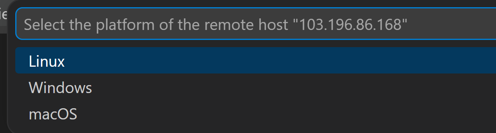
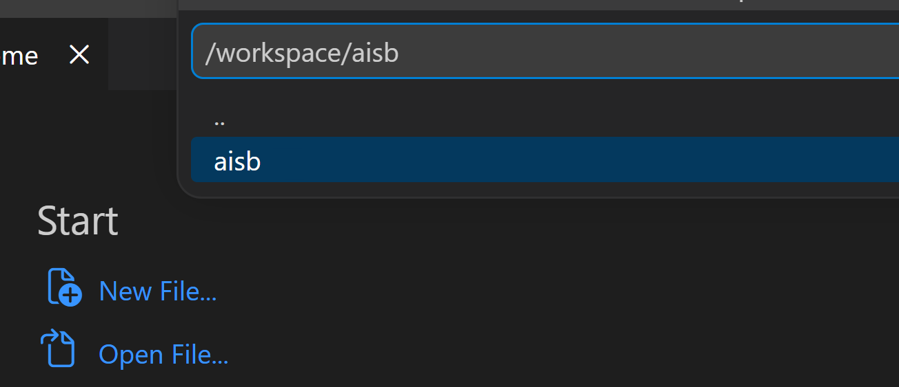
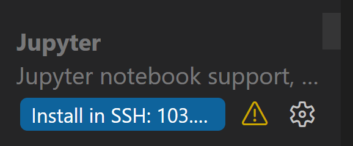

Welcome to the [AI Security Bootcamp](https://www.aisb.dev/)! This repo contains the exercises and links to the reading material you will go through during the bootcamp.

**Suggested time:** 45–60 minutes

**Exercises:** [Open the participant setup instructions](day0_instructions.md)

### Setup

- Install [VS Code](https://code.visualstudio.com/) and confirm that you can access GitHub.
- Obtain the event-provided API key and RunPod connection details before the live programme.
- Connect to your RunPod machine as described below.
- Complete the checks in the [participant setup instructions](day0_instructions.md) on the remote machine.

### Connecting to your RunPod machine

All exercises run on a remote RunPod machine provided by the instructors. **You
do not need Docker or a local Python environment.** Set up VS Code to connect to
the machine over SSH:

**If you have a coding agent like Codex or Claude Code you can give it these
instructions to run through with you.**

**On your local machine**

1. Install the [Remote - SSH](https://marketplace.visualstudio.com/items?itemName=ms-vscode-remote.remote-ssh)
   extension in VS Code.
2. Set correct permissions on the SSH key file given to you by the instructors.
   SSH clients refuse keys that are readable by other users.

   **Linux / macOS:**
   ```bash
   chmod 600 <private-key-path>
   ```

   **Windows** (PowerShell, run as your normal user, not as Administrator):
   ```powershell
   $key = "<private-key-path>"
   icacls $key /inheritance:r /grant:r "$($env:USERNAME):(R)"
   ```

3. Add the machine to your SSH config file, `~/.ssh/config` (on Windows:
   `C:\Users\{you}\.ssh\config`; create it if it does not exist). In VS Code,
   you can open it from the command palette (`Ctrl+Shift+P` on Linux/Windows
   or `Cmd+Shift+P` on macOS) with **Remote-SSH: Open SSH Configuration
   File...**. Add this entry, replacing `{ip}`, `{port}`, and
   `{private-key-path}` with the IP address, port, and **absolute** path to
   the SSH key given to you by the instructors:

   ```
   Host aisb
       HostName {ip}
       Port {port}
       User root
       IdentityFile {private-key-path}
       IdentitiesOnly yes
       PasswordAuthentication no
       StrictHostKeyChecking no
   ```

   A filled out example:

   ```
   Host aisb
       HostName 12.34.56.78
       Port 1234
       User root
       IdentityFile ~/.ssh/my-private-key
       IdentitiesOnly yes
       PasswordAuthentication no
       StrictHostKeyChecking no
   ```

   If you are given a new machine later, update only `HostName` and `Port`.

4. Test the connection with `ssh aisb` in the terminal. You should be about
   to login to the remote machine.

5. In VSCode, open the command palette (`Ctrl + Shift + P`)
   and select **Remote-SSH: Connect to Host...**,
   then pick `aisb`. VS Code will open a new window connected to the remote
   machine.

6. When prompted for the remote platform, select **Linux**.

   
7. Once connected, open the folder `/workspace/aisb`.

   
8. You also need to install the **Jupyter** extension on the remote
   server (VS Code shows an "Install in SSH" button for extensions that
   aren't installed remotely yet).

   
9. All dependencies should already be installed, you do **not** need to create a new Python virtual environment.

   If an import fails (for example `from openai import OpenAI`), the machine's
   setup did not finish. Run the recovery command given in that day's setup
   section from a terminal on the remote machine and let it run to completion.
   Do **not** `pip install` other packages by hand; the pinned requirements are
   the versions the exercises are tested against.

### Connecting to your Day 2 machine

Day 2 runs on a separate Google Cloud VM, because its exercises start Docker
sandbox containers.

1. Follow steps 1–2 of
   [Connecting to your RunPod machine](#connecting-to-your-runpod-machine)
   above.

2. Add a second entry to `~/.ssh/config` (or `C:\Users\{you}\.ssh\config`
   for Windows users), using the IP address and key the
   instructors give you for Day 2:

   ```
   Host aisb-day2
       HostName {ip}
       User participant
       IdentityFile {private-key-path}
       IdentitiesOnly yes
       PasswordAuthentication no
       StrictHostKeyChecking no
   ```

3. Test the connection with `ssh aisb-day2` in the terminal. You should be
   able to log in to the remote machine.

4. In VS Code, open the command palette and select **Remote-SSH: Connect to
   Host...**, then pick `aisb-day2`. When prompted for the remote platform,
   select **Linux**.

5. Once connected, open the folder `/home/participant/aisb`.

6. Install the **Jupyter** extension on the remote server, as in step 8
   above.

7. Select the Day 2 interpreter: command palette → **Python: Select
   Interpreter** → `.venv-day2`.

8. Test by running **on the remote machine** `docker run --rm hello-world`
   in a terminal to check. You should get a messahe to the effect of
   ```
   Hello from Docker!
   This message shows that your installation appears to be working correctly.
   ```

## Prerequisites

Review the prerequisites and setup instructions below to ensure you have the required skills and tools to complete the bootcamp.

## In-person instructions
If you're attending the bootcamp in person, you will spend most of the days pair programming with your assigned partner on the exercises for the given day.

Before the first day, make sure you have completed the setup instructions below.


### Completing exercises
To view the instructions for a section, navigate to the respective directory (e.g., `1.1-llm-internals`) and open the `*_instructions.md` file located there. We recommend you open it in your IDE and view the markdown (right-click and select "Open Preview" in VS Code).

The recommended way to complete the exercises is to make a new `.py` file (suggested name: `day#_answers.py`) in the directory for the day.

The instructions will contain code snippets you need to complete. Add a new `# %%` line to your answers and paste the code snippet under that line. If you went through the setup instructions correctly (with VS Code), you should see "Run Cell" option above the `# %%` which will execute the code in a [Python Interactive Window](https://code.visualstudio.com/docs/python/jupyter-support-py#_jupyter-code-cells). The code snippets contain tests that should initially fail. Complete the TODOs in the code and run the cell until all the tests pass.

<details>
<summary>Using Python cells</summary>
If you add more code at the bottom of the file and follow it with another `# %%`, this will create another cell which can be run independently in the same session. Cells can be run many times and in any order you choose; the session will maintain variables and state until it is restarted.
</details>

### Using git
We recommend you save your progress for each day (the answer files you will create with your assigned partner) to a branch in this repo. This will make it possible for you to switch between computers you will use while pair programming, and make your solution available for you to reference later.

First, configure your git repo with:

```bash
git config pull.rebase true
git config --type bool push.autoSetupRemote true
```

**Every day in the morning**, make sure you have the latest version of the repo:
```bash
git checkout main
git pull
```

Make a branch for the day: `git checkout -b <branch name>`, where your branch name should follow the convention `day#/<name>-and-<name>`. For example, if Tamera and Edmund were pairing on the day 3 content, the command would be `git checkout -b day3/tamera-and-edmund`. If you share a first name with someone else in the program, use a unique nickname of your choice for disambiguation.

Create a new file for your answers (see [completing exercises](#completing-exercises) above) and work through the material with your partner.

As you work, commit changes to your branch and push them to the repo. To make and push a commit:

```bash
git add :/
git commit -m '<your commit message>'
git push
```

If you want to switch what computer you work on with your partner, they can check out the latest version of the branch with:

```bash
git fetch
git checkout <branch name>
git pull
```


### Testing your setup
If you'd like to try a sample exercise and test your setup, go ahead and complete [day0](day0_instructions.md)!
